## Structural Deep Embedding for Hyper-Networks

### 1. Introduction

这篇论文介绍了一种处理具有 hyperedge 的网络结构的方法.

#### 1.1 Hyperedge 

一般的网络结构, 我们的edge都是二元的, 即使有多元的(即需要多个node的参与), 也是将其分解为多个edge. 作者的初衷是认为, **这种 hyperedge是不可分解的**. 因此提出了这个方案.

hyperedge网络还有一个难以处理的地方, 有很多node之间的关系并不是通过直接联系的, 而是通过邻接的邻接, 或者是邻接的邻接的..., 现在的网络模型还无法发现这种结构的关系.

#### 1.2 Heterogeneous 

真实世界的网络往往还具有异质性(Heterogeneous). 这种特性表现为, network的节点不止是embedding不一样, 并且在类型上具有本质的区别. 例如在人际网络中, 老师和学生属于完全不同的类型的节点.

#### 1.3 本文贡献

##### 1.3.1 DHNE

提出了一个DHNE网络模型去embedding indecomposable hyper-network embedding.

并且算法复杂度是 O(n)

##### 1.3.2 Indecomposibility

提供了一种处理局部和全局的非分解性结构信息的方法.

##### 1.3.3 Experiments

在真实世界网络上进行了实验, 效果不错.

### 2. Notations and Definitions

#### 2.1 Hyper-network

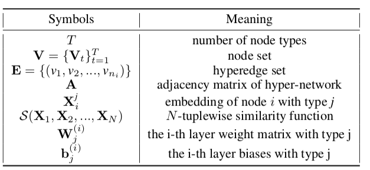

相比于普通的 graph network, 这里的网络定义多了两个东西, 

第一个是node 的type, 这个是为了支持异质网络特性.

第二个是拥有 node 的 set 作为参数的边, 这个是为了支持 hyperedge.

然后, 每个node V 拥有一个embedding X.

当 T=1 时, 也就是node的种类只有一种时, 网络从异质网络退化为普通网络.

#### 2.2 The first-order proximity

一阶接近, 是一种近似度标准, 说的是n个node之间的相似度, 只看这两个n就可以.

比如说, 我们看n个人的性格像不像, 这里的方法是通过分析这n个人来进行计算.

#### 2.3  The second-order Proximity

二阶接近, 是一种近似度标准, 说的是n个node之间的相似度, 将n个node的各个node的邻接点当作计算相似度的参数.

看n个人性格像不像也可以通过他们的朋友来得知, 人以类聚物以群分嘛.

#### 2.4 图示

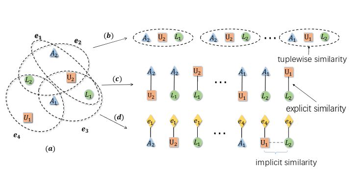

其中的圈就是 hyperedge.

### 3. Deep Hyper-Network Embedding

#### 3.1 一图胜千言

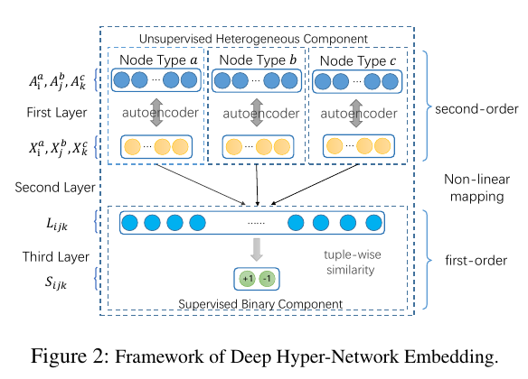

只看这个图的话,

- 模型先通过自编码器把不同类型的 node, 转化为向量.

#### 3.2 Loss function

##### 3.2.1 Property 1

loss function 应该具有的一点特性是, 具有同一个 hyperedge 的 nodes 之间的相似度应该高, 反之应该低. 公式为:

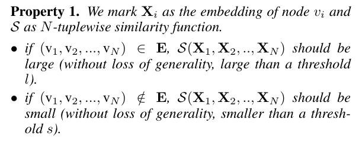

##### 3.2.2 **Theorem 1**

若 $\mathcal{S}(X_1,X_2,...,X_n)$ 是一个线性函数, 那么 $\mathcal{S}(X_1,X_2,...,X_n)$ 是无法满足 Property1 的.

论文中给出了证明, 有兴趣的看论文.

因此论文提出了下面这个非线性变换的函数, 这个函数的目的是把被一个hyperedge连接的nodes合三为一, 映射到一個 common latent space L.

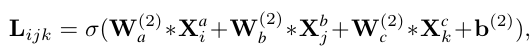

> **本论文使用的 hyperedge 最大是三元关系**

接下来利用这个新的space中的向量去计算三个nodes之间的相似度.

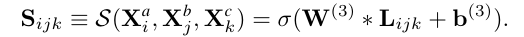

##### 3.2.3 Loss function

这个模型从两个思路来设计 loss function, 

###### 1. first-order proximity

第一个是, 同一个 hyperedge 下的 nodes 之间的 first-order proximity 应该是很大的, 反之, 不属于同一个 hyperedge 的 nodes 的 first-order proximity 应该是很小的.

为了满足这个条件, 设计了如下的一个函数.

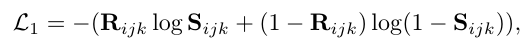

可以看出, 这个函数本质和 逻辑回归的损失函数很像, 很好理解.

> 其中的 $R_{ijk}$ 是一个 1函数, 即, 如果, node ijk 属于一个 hyperedge, 则等于1; 反之为0.

###### 2. Second-order proximity

- **邻接矩阵A**

  第二个是, second-order proximity, 处理思想和上面一样, 由于这个是 hyperedge 网络, 所以在定义和处理上有一些复杂. 

  首先在上面的模型图中, 一开始就有个 $A$, 这里的 A 其实就是点和点之间的邻接矩阵. 

  A 是一个矩阵, 其中, $A=HH^T-D$

  H 也是一个矩阵, $H_{ij}$ 代表的是第i个node, 是否被 edge j 包含在内. 因此, 矩阵中全是0/1值. 那么, $HH^T$ 就是一个将点和点之间的互连信息全部汇总的矩阵, 其中 $(HH^T)_{ij}$, 指的是, 第 i个node和第j个node之间的连接数. D是一个对角矩阵, 对角线上是每个node的度值. 

  那么 $A_{i}$ 这一行就是说, 第i个node与所有node的连接信息.

- **autoencoder**

  模型通过对 A 中的每一行进行autoencoder来获得node的向量.

  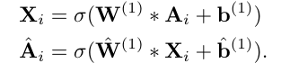

  autoencoder的意义是, 使得拥有相似邻居的节点的embedding相近.

  这样就提供了 Second-order proximity 所需要的信息.

  autoencoder的重建误差函数是 :

   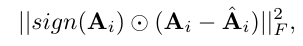

- **多个autoencoder**

  并且, 模型对不同类型的node之间进行了区分. 另 $A_i^j$ node i 与代表 type 为 j 的所有node的相关信息.

  > 不过这里我很不解的是, 如果这样设定的话, 岂不是只能表示同种node之间的相关关系.

- **Second-order proximity**

  这样就提供了Second-order proximity的损失函数所需要的信息.

  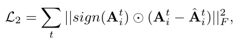

###### 3. Loss function

最后的损失函数是:

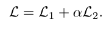

##### 3.2.4 小结

这里模型的设置感觉是非常经典的, 非常巧妙的

- 利用损失函数去表达将向量应该具有的信息加入到模型中, 即关于属性1的假设.
- 利用autoencoder 去加入二阶信息.

### 4. Optimization

省略

### 5. Experiment

这里采用的是网络重建任务和link 预测任务, 基于四个数据集去评价向量的优劣.

#### 5.1 四个数据集

只关心最后一个, 即wordnet的数据集, 这里将边视作一个node, 构建了 <词汇-关系-词汇> 这样三元关系的 hyper-netwoek.

#### 5.2 评价用任务

网络重建任务是利用训练好的向量去预测原来网络之中的关系, 将关系加入到网络中.

效果如下:

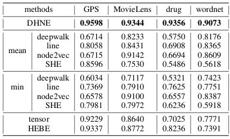

link 预测任务是对于新的网络中的link的预测.

效果如下:

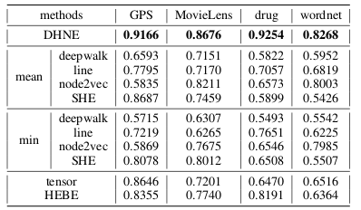

