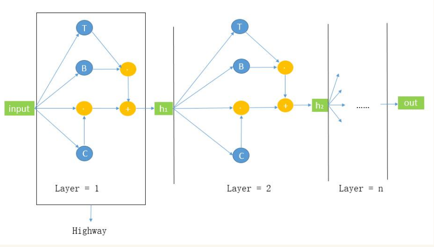
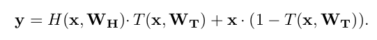
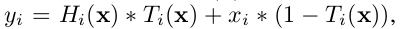
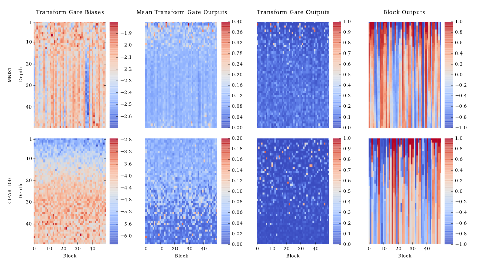
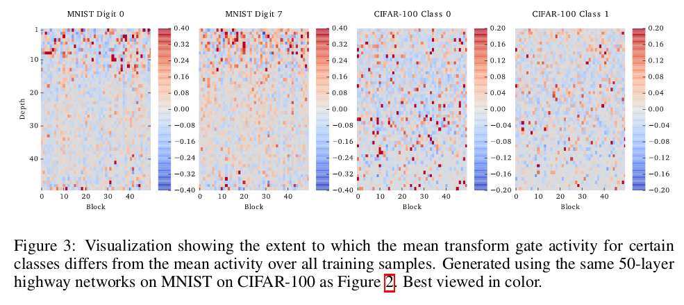
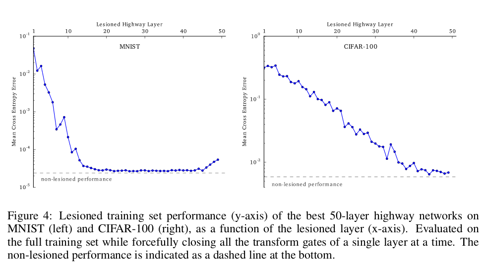

## Training very deep network

### 1. Motivation

深度网络对于监督学习任务的在准确度性能上的的提升是非常显著的. 之前的研究表明, 即使在更小的感知域下, 更深的网络在Imagenet的1000分类任务上的效果, 相比于shallow网络, 从84提升到了95. 

深层的网络能够更有效的表示函数族, 感觉上可以体会为有层级结构和没有层级结构的差异. 比如说像n元parity problem 问题, 这个问题如果用shallow神经网络去解决, 需要很大的网络结构. 但是如果通过循环神经网络去解决, 就只需要三个神经元和5个权重. 这是因为有些问题的本质是基于序列或者是拥有层级结构的.

但是训练深层网络是一件困难的事, 例如梯度消失或者Cliffs and Exploding Gradients等等的问题. 近年来也提出了很多方案, 详细见补充.

为了经过深层传递之后造成的激活值和梯度的 poor propagation 问题. 这里受启于LSTM网络, 提出了 highway network 去使得信息在层级之间的流动变得简单. 这个想法是来自LSTM中adaptive gate机制, 这个结构可以使得信息在传递多层网络后而不至于衰减. 我们称这个机制为 information highways. 

研究表明, highway network 可以直接通过SGD训练. (不同于深层plain network在SGD难以训练的问题) 

### 2.  Highway Networks

Highway Networks 就是在原来的网络中加了一个gate. 简单图示如下:

原来的输入为 $x$, 经过 $H(x,W_h)$ 进行非线性映射后, 成为该层的隐藏状态, 再于 $T(x,W_t)$ 结合. 进行放缩. 再与 $C(x,W_c)*x$ 相加, 直接加入上一层的输入信息. 为什么说直接呢, 因为, $C(x,W_c)=1-T(x,W_t)$.

最后的公式就是:

这样也就是说, 当 $T(x,W_t) = 1$ (这里的 $1$ 是向量. )的时候, 这就是一个普通的plain网络. 

而当 $T(x,W_t) =0$的时候, 这就是一个将值直接传给下一层的输入. 

这里, $T(x,W_t) $ 使用的是 sigmod 函数. 所以, 其值处于 (0,1) 的范围.

其中, $y$ 是一个向量, 设维度为 n, 那么每层的输入向量维度也是n. 因为这一层的输出是下一层的输入. 那么对于, $y_i, i\in (0,n-1)$ 而言, 每一个 $y_i$ 就是一个block的结果. 也就是:

这里的每一个数据都是标量. ($H_i(x)$是标量, $H(x)$ 不是标量.)

#### 2.1  Constructing Highway Networks

在网络搭建的过程中,需要注意的点有两个. 

- $x,y,H(x,W_h)$ 和 $T(x,W_t)$ 的维度要一样, 也就是说, $W_h$ 和 $W_t$ 的维度要一样,并且都是正方矩阵.  但是, 想要改变中间表征的维度, 也就是使得 $x$ 和 $y$ 的输出不一样的话, 可以在使 $x$ 进入 highway network 之前经过一层简单的 plain layer , 也就是单纯的非线性映射层. 

- 由于这篇论文是在图像识别任务上进行的事业, 用的是CNN模型, 所以存在感受野的问题, 感受野就是某一层所接受的来自图像的卷积框的大小, 也就是, 这一层的任何一个值的自变量的数目.

  **对于这个网络, 卷积的 highway 层对H和T的变换都使用了权重共享和本地感受野. **

  > 原文:Convolutional highway layers utilize weight-sharing and local receptive fields for both H and T transforms

  并且, 两者感受野的大小是相同的. 这里的加粗的一句话是关于图像的专业结构,我不懂.知道的各位还希望能够在评论中告知一下, 谢谢.

#### 2.2  Training Deep Highway Networks

- **初始化问题**

  由于我们一开始是倾向于不经过转化的信息, 也就是使第一项的数据占有更小的比例, 因此, 使得 $T(x) = \sigma(W_T^Tx+b_T)$ 中的 $b_T$ 的值偏负数.

  实验中, 对于10,20,30层的 highway network , 建议分别采取, -1, -2, -3 的bias值.

- **训练**

  使用简单的SGD, 在试点实验中, 对于1000层的深度, SGD没有表现出不适.

### 3. Experiments

略过

### 4. Analysis

这个地方的分析特别特别有意思!

#### 4.0 Look at some graphs 

- **接下来对这个图进行介绍:**

  - 上面四个是关于MNIST实验的, 下面是关于CIFAR-100实验的.
  - 横坐标是block的坐标, 一共有50个. 纵坐标是网络的层数, 从上向下依次加深.
  - 第一列是 $T(x\cdot W_t+B_T)$ 中的 $B_T$ 的值, 
  - 第二列是输入是所有样本的 $H(x\cdot W_H+B_H)\cdot T(x\cdot W_t+B_T)$ 中的值的平均, 也就是 $E_{~x}\{T(x\cdot W_t+B_T)\}$  
  - 第三列是, 随即取了一个样本下的 $H(x\cdot W_H+B_H)\cdot T(x\cdot W_t+B_T)$ 的值. 
  - 第四列是, 随即取了一个样本下的 $H(x\cdot W_H+B_H)\cdot T(x\cdot W_t+B_T)+x\cdot (1-T(x\cdot W_t+B_T))$ 的值. 
  - 两个模型的bisas的值被初始化为 -2 到 -4 之间的值. 

- **下面解释这些图中隐藏的信息**

  - CIFAR-100的biase的变化是变大的, 可以从颜色的渐变看出来.

  - 奇怪的是, 虽然biase变大, 但是 $H(x\cdot W_H+B_H)\cdot T(x\cdot W_t+B_T)$ 却在变小. 这说明, 网络较低层的biase的负值不仅没有关闭门 ( 也就是使得较大的 $H(x\cdot W_H+B_H)$ 通过, 因为门是给原来过不去的 $x$ 开设的) ,而反而使得 $H(x\cdot W_H+B_H)$ 的信息保存地越来越少.

  - 接下来对比, sample平均的 $H(x\cdot W_H+B_H)\cdot T(x\cdot W_t+B_T)$ 值的变化 和 随机挑选一个sample的情况下 $H(x\cdot W_H+B_H)\cdot T(x\cdot W_t+B_T)$ 的变化.

    在, sample平均的情况下, 我们很明显的看到, 随着层数的增加, transform gate activity 越來越小(在这里,我们称之为**渐变特征**), 但是在sample随机的情况下反而根本看不出什么变化, 大部分都是非常稀疏的. 说明:

    **随着层数的增加, transform gate activity 越來越小的特点不是每个sample都有的.**

    那么怎么样才能使得个体非渐变的特征, 平均之后便出现了这种渐变现象呢?

    **每个sample没有在50个blocks上表现出渐变特征, 但是在某几个维度(blocks)表现出了渐变特征, 而每一个sample的渐变的维度都是不同的**

  - 最后一个图表达出了 "信息高速通道" 的感觉. 从这个图中可以看出, 有很多block在一些层次之后的值就保持了稳定, 说明, 在那个block上, low layer的信息, 直接传到了最后.

#### 4.1 Routing of Information

上面我们通过 sample平均和sample随机的图像的不同推理出了:

**每个sample没有在50个blocks上表现出渐变特征, 但是在某几个维度(blocks)表现出了渐变特征, 而每一个sample的渐变的维度都是不同的** 

这样的结论, 但是这个结论还需要更严密的测试证明. 

本节, 作者利用MNIST和CIFAR-100中的数据类别来进行了分类检测. 如下图:

这个图是不同类别数据 sample的 transform gate activity 平均值. 其中可以很明显的看出, MNIST 0的类别和 MNIST 7 的情况是完全不一样的. 说明, 上面的猜测是正确的.

并且,还可以注意到, MNIST 0和 MNIST 7的图像,在15层以内的差距较大, 但在之后就没有太大差距, 但是CIFAR-100的两个类别,整体都差距不小.

#### 4.2 Layer Importance

上面4.1 的最后一段, 我们注意到了, MNIST根据类别的图像在15层之后就没有太大变化, 那么是不是就不重要呢?

为了检测这一点, 作者采用层损毁的方式去检测不同层次的重要性,  简单说就是赋予 $T(x)$ 的值为0, 使得这一次的作用是单纯的值传递. 然后再做该模型分布与完整模型分布的交叉熵测试, 结果显示:

MNIST网络的15-45层, 显得没有效果. 而在CIFAR-100中利用到了将近40层.图示如下,并且,发现, 层数的重要程度随着层数的增加线性减小:

**这个地方可以说是很厉害了, 这个模型不仅可以得出很好的效果, 还可以用来检测问题所需要的层数**

### Supplementary

- 更好的优化方案:
  - Training deep and recurrent networks with hessian-free optimization. (2012)
  - On the importance of initialization and momentum in deep learning.(2013)
  - Identifying and attacking the saddle point problem in high-dimensional non-convex optimization.(2014)
- 好的初始化方案.
  - 特别是对激活单元的参数,各层之间方差一致的初始化策略.
    - Understanding  the  difficulty  of  training  deep  feedforward  neural networks.(2010)
    - Delving deep into rectifiers:  Surpassing human-level performance on ImageNet classification(2015)
  - Random walk initialization for training very deep feedforward networks
  - Exact solutions to the nonlinear dynamics of learning in deep linear neural networks(2013)
- Experiments showed that certain activation functions based on local competition may help to train deeper networks
  - Maxout networks(2013)
  - In Advances in Neural Information Processing Systems(2013)
- 利用层级之间的跳跃连接(skip connection)来提升信息流动.
  - Deep learning made easier by linear transformations in perceptrons(2012)
  - Generating sequences with recurrent neural networks(2013)
  - Deeply-supervised nets(2015)
- Fitnets策略, 属于预训练方案的一种, 属于一种模型压缩的方法.
  - FitNets: Hints for thin deep nets.(2014)
  - Learning complex, extended sequences using the principle of history compression.(1992)
- trained layer-wise to help in credit assignment 