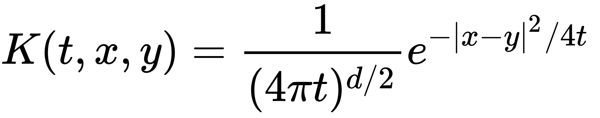
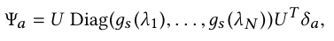
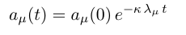
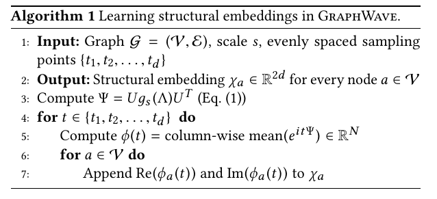
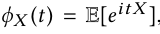
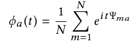
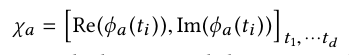
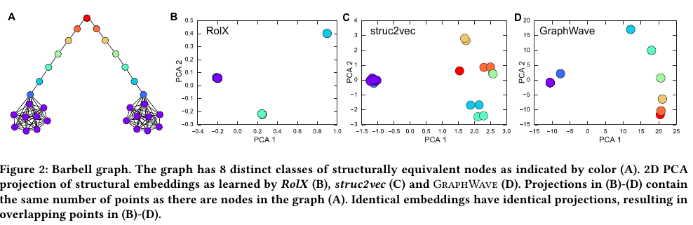
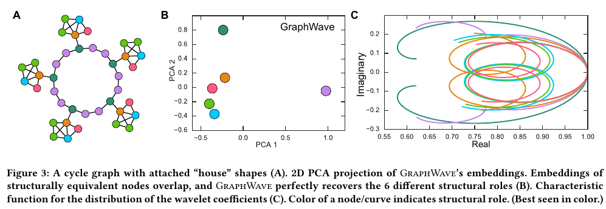
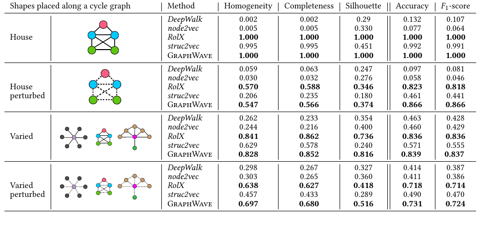

## GraphWave

### 1. Introduction

#### 1.1 任务描述

##### 1) 目的

开文点题是个好习惯 :

本文的目标是 **识别具有相似网络结构的节点, 即使这些节点相距较远.** 

> 这里和平时的网络点向量有所不同, 与其语义向量相比, 这里更集中于其网络结构.
>
> 如何为我所用: 这个可以用来检测 Anological 结构. 

##### 2) 直观理解

- 这里就是从数据可以学得该向量的依据 :具有相似结构的node在网络中发挥相似的作用. 

- 先行研究的方法 ：去根据网络的 **平滑性**, 以及**距离上的相近** 去学习相似结构.

  > 不懂平滑性是如何使用的.

#### 1.2 方法简介

##### 1) 离散方法

一个node的结构的离散表示其实就是其坐在网络位置周围拓扑结构. 

不好 : 因为需要大量的人工定义

##### 2) 连续方法

- 表示方法

  这里就是我们需要的做的, 将其表示为一个向量. 

  对于节点node a, 这里的符号为 : $\mathcal{X}_a$

- 近似度量

  自然而然的, 就可以用这个表示node的相似度, 使用方法是:
  $$
  if\ \  \ dist(\mathcal{X}_a, \mathcal{X}_b)\le\epsilon
  $$
  则成这两个node的结构相似.

- 学习步骤:

  1. 需要学习对应的node Embedding
  2. 需要学习阈值 $\epsilon$.

#### 1.3 本文方法

##### 1) Intuition

这里使用的方法是 **GraphWave**. 基于的是 **graph signal processing.**

学习node Embedding的根据是 **diffusion of a spectral graph wavelet centered at the node.即, 以node为中心的**谱图小波的扩散. 

简单来说就是, 以每个node为中心向周围发出能量, 根据自己的能量与其周围的node发出的能量产生的response作为判断其拓扑结构的依据. 这个其实就像池塘中的波纹一样. (接下来会一直使用水滴去比喻)

我们称这里的波纹(能量)的交互为 **wavelet**. 这个 wavelet 的数值, 直接**反应了其拓扑结果**. 这里是通过了证明的(即, 含有足够的信息).

> 感觉这里和GNN非常的像啊, GNN中不同的水滴之间拥有不同的交互方式, 这个由其边以及两个点的向量定义. 但是这里如果只考虑拓扑结构的话, 应该不需要那么复杂的向量表示和复杂的交互方式.

##### 2) **Wavelet** 

**Wavelet** 是一个信号波.是一个震荡函数. 

##### 2) 简单介绍

- 非L2距离的算法

  这里需要首先明确, 我们要做的是找到相似的node结构, 因此我们不能过多的关注每个点的具体信息. 并且, 一般的那种利用l2距离来对 pairwise 的node对进行比较的方式, 会对两个点之间的距离比较敏感. 不利于较远的node的运算.

- 基于图的概率分布

  因此, 这里采用了用对图的概率分布的描述. 这样就会忽略每个点的具体信息, 也就同时淡化了其位置带来的影响. 更加详细的, 这里的概率分布的随机变量是图中节点 diffusion 的方式.

- 编码方式

  这里通过 empirical characteristic function 去编码wavelet的概率分布. 

##### 3) 优点

- 线性复杂度
- 具有健壮性, 对小的变化不会反应敏感.

#### 1.4 先行研究

##### 1) 图结构相关研究

- RolX : 特征工程方法 : 根据点的特性(度, 三角结构)来分类 
- struc2vec : 
  - 根据拓扑度量建立一个多层的graph
  - 还根据了随机行走去捕捉结构信息
- Neural representation learning methods
  - structure2vec, neural fingerprints, graph convolutional networks, message passing networks 

##### 2) Graph diffusion kernels

- Kernel 在寻找目标几何结构以及图像的形状匹配领域已经有了应用.
- 本研究第一次将其用于真实世界的网络, 之前的研究都是将diffusion应用了每个节点, 这样只能用于特定的node. 因此, 这里并不是求每个点的diffusion发生时的情况, 而是求其diffusion的shape.

### 2. Structural Embeddings

#### 2.0 符号说明

- 图 : $\mathcal{G}=\mathcal{(V, E)}$ 共有 $N$ 个 nodes. 其中: $\mathcal{V}={a_1,...,a_N}$
- 邻接矩阵 $A$. 
- 度矩阵 $D_{ii}=\Sigma_jA_{ij}$ (是一个对角矩阵)
- 拉普拉斯矩阵 $L=D-A$

#### 2.1 Spectral graph wavelets

##### 1) 拉普拉斯矩阵分解 :

$L=D-A=U\Lambda U^T$ . 

其中, $\Lambda=\operatorname{Diag}(\lambda_1,...,\lambda_N)$

> 关于拉普拉斯矩阵的性质, 见笔记 [知识点笔记]:谱聚类

##### 2) heat kernel 

函数形式为 : $g_s(\lambda)=e^{-\lambda s}$. 这里的 s 是一个放缩参数. 这里假设s已知.

> 热核函数是热方程的基本解. 热方程指的是, 热量随着时间变化介质中的传递速率.
>
> 也就是说, 这里用热能量比作节点的能量, 将其在网络中传导.
>
> 其公式基本形式为一个随时间变化的高斯函数:
>
> 

##### 3) Spectral graph wavelet(谱图小波) 

谱图小波其实是一个向量, 其左边是一个矩阵, 右边的 $\delta_a$ 是一个one-hot矩阵. 可以用来提取矩阵中的某一行向量. 表示的是以一个节点附近的能量场. 

其实这里的 $g_s(\lambda)$ 是一个函数的一部分, 正确的wavelet是一个关于时间的函数, 类似于下面的形式:

> 取自下面提到的那个笔记: [知识点笔记]拉普拉斯矩阵在网络热传导中的应用

而这里的 $g_s(\lambda)$ 将 $t$ 去掉, 只考虑这种变化的速度, 以及趋势.  

> 至于具体为什么用 $g_s(\lambda)$ 的形式, 请看笔记:[知识点笔记]拉普拉斯矩阵在网络热传导中的应用. 不同的是, 在这个笔记中假设每个点上的信息是标量, 而在这里是向量, 即**多维上的热扩散.** 

那么, 左边的矩阵储存的就是所有的扩散后的能量信息. 

##### 4) 特征值的意义: 

网络上的热扩散, 是

1. 首先拉普拉斯矩阵的对角化后的基底, 将每个点的热信息转换到另外一个空间.
2. 其次特征向量控制的是不同基底上的热扩散速度. 因此, 特征值越大, 说明在那个基底方向上扩散得越快.
3. 最后在通过乘以基底矩阵的转置, 变换回点的热信息矩阵. 

#### 2.2 GraphWave algorithm

##### 1) 目的

通过这个算法, 可以学得每个节点的 structures embeddings.

拥有结构上相似的节点将具有相近的embedding. 

##### 2) 具体算法

###### 第3行 

1. 计算每个点附近的能量场 - 即谱图小波. 
2. 相比于之前的将 缩放因子 s 作为参数的研究, 这里利用一个神经网络的去学习 s. 这个神经网络的输入是一个点的 wavelet,  输出是这个点的 s. 
3. $\Psi_{ma}$ 代表的是node a 从 node m 那里获得的能量. 
4. 相似的node具有相似的谱图小波 $\Psi$. 
5. 这里的前提是, 假设我们知道如何解决同构的映射问题, 即, 将两个node a和b的相邻节点进行对应. 这里的解决方法就是, 
   - 将**谱图小波看做一个分布,** 
   - 然后利用一个经验特征函数的变换得到每个分布的特征向量.
   - 再利用采时间点的方式, 作为不同分布的特征函数的代表向量.

###### 第4-7行

1. 定义一个概率分布的特征函数:

   概率分布 : $X(t)$

   概率分布的特征函数 : 

2. 在这里, $\Psi_a$ 是概率分布, 则:

   $$\Psi_a$$ 的特征函数是 :

   

3. 采不同时间点取其作为特征向量

   这里采d个点的时候, 会产生2d个值, 因为有复数部分. 

   那么, 每个点的embedding就可以表示为:

   

> 至于为什么采用这样的方式采分布的特征, 可以参考论文 : 
>
> Eugene Lukacs. 1970. Characteristic functions. (1970). 
>
> 总而言之就是用来将分布转化为向量的一种方法, 
>
> 这里实在是没有精力深究了, 知道的还请告知.

##### 3) 计算距离

简单的用l2距离就可以.

##### 4) Scaling parameter

这里的Scaling parameter代表的是一个点的辐射范围. 

当 s 很小的时候, 一个node只能对周围近的一些点产生不可忽略的影响. 反之, 则影响较远. 

论文中还介绍了一种将不同 s 进行结合的方法. 具体在第四章.(估计不会写到这里)

##### 5) 计算复杂度

反正不高

### 3. Analysis Of GraphWave

- 3.1 : 数学上证明了 图谱小波 蕴含着 网络中不同node的拓扑结构信息.
- 3.2 + 3.3 : 数学上证明了 相似的结构的 node 的 Wavelet embedding是相似的. 

真的不想再花时间在这片论文上了, 跳过.

### 5. Experiment

#### 5.1 Baseline methods 

这里使用了两个SOTA学习网络结构的模型 struc2vec 和 RoIX. 

也同时在关于node语义上的方法 node2vec 和 DeepWalk 进行对比. 强调学习结构和学习语义的不同.

并且, 这里采用的是合成的graph进行的测试.

#### 5.2 Barbell graph

生成了一个下面的图:

A图是生成的图, 共八种点, 右边的是三种方法下学得的Embedding的PCA分解结果.

可以发现:

- struc2vec : 顺序不对, 黄色的点应该和绿色更近而不是蓝色.
- RoIX : 太过集中, 不能区分细节
- 三个方法都可以将两个不同分支的锤子归成近似的embedding, 也就是说和node2vec等等的方法不一样, 这里学得是 structure. 

#### 5.3 Graphs with planted structural equivalences

这个实验除了在正确的结构设计之上, 还加了10%的噪音. 

并且最右边的这个图是一个节点特征的直观展示, 在该图中，不同形状的特征函数捕获不同的结构角色。我们注意到这些曲线所携带的蓝色，浅绿色和红色节点的作用之间的视觉接近度，以及它们与核心深绿色和紫色节点的明显差异。(本段后半段摘自paperweekly)

通过各种各样的实验, 如下:

可以知道:

- 这个方法好
- 学习node embedding 和 node structure embedding是不一样的.