## 模型简述

研究室大佬的文章, 最近看的论文也是为了做这个方向做准备.这里简单介绍.

### 1. Introduction

#### 1.1 TransE

这里用的驱动模型是TransE模型, 即 :

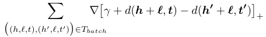

最后的一项是负样本. $d(h+l, t)$, 是Entity h 经过 Relation l 映射之后的点与尾Entity t的距离. 当然, 越近代表这个关系越成功.

#### 1.2 Nerual Graph Network

处理图结构的网络. 具体见之前的笔记.

#### 1.3 本文intuition

这个模型就是一个使用Nerual Graph Network去处理图结构信息, 然后使用TransE去进行学习的方法.  通过这个方法去**增加使用模型处理预测未知Entity的能力**

本身很简单, 但是这个方法最大的优点是:

**显式地进行了 parameter sharing**

>  即显式地向每个Entity Embedding和Relation Embedding中加入了和其相关的Entity和Relation的信息. 

**何为隐式**

这里之所以称之为**显式**, 是相比于一般Latent Model 的 **隐式** , 一般的Latent Model模型中, 通过对一个关系 $(e_h^1, r, e_t^1)$ 的学习, 使用 $e_h^1, e_t^1$ 改变了一个 r 的Relation Embedding, 然后再下一个关系 $(e_h^2,r,e_t^2)$ 中, 通过使用改变了的 r 去改变 $e_h^2, e_t^2$ 的向量, 这样就使得 $e_h^2, e_t^2$ 和 $e_h^1, e_t^1$ 之间有了联系. 关于这一点的描述详见, A Review of Relational Machine Learning for Knowledge Graphs 中的 4.1.5 节. 

**显式的设计**

这里通过主动的GNN的propagation来 **显式** 地将其他embedding的信息整合到某一个embedding中. 

**显式的优点**

Entity Embedding之间参数共享对于提升disjoint sets of entities 之间的知识转移很重要. 这里的 「disjoint sets of entities 之间的知识转移」就是指, 在几个互相之间没有连接的但是共享rules 的 sub-graph之间, 利用其中几个sub-graph学得的信息去对另外的sub-graph中的关系进行推理. 当然这个「另外的sub-graph」 是必须要有一些基础关系是已知的, 具体见 「On Inductive Abilities of Latent Factor Models for Relational Learning」 论文笔记的5.2.3节的实验设计. **可以说, 一定程度上体现了处理未知信息的能力**

### 2. 模型设计 

#### 2.1 问题设定

训练过程和一般的训练知识图谱补全的问题一样. 

重点在于, 这个模型在test中要可以处理未知Entity. 

即, 在test时, 会被给出一个新的sub-graph, 这个sub-graph拥有新的实体. 并且这个实体又和其他几个已知Entity相连.如下图所示:

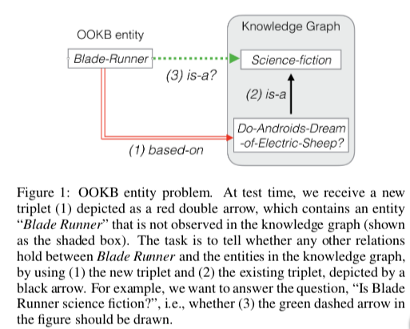

#### 2.2 模型详述

上面提到了TransE,

 

这里的h,l,t就是embedding本身, 该模型再次之上对于Loss函数进行了两步修改.

#### 2.3 第一步修改(propagation)

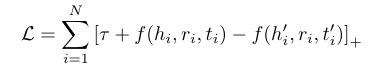

这里的符号和上面的有些出入.

这里将简单的求距离的 $d(h+l,t)$ 函数换成了 $f(h,l,t)$ 函数,  $f(h,l,t)$ 函数就用到的GNN. 这里是最大的变化.

其中, 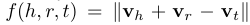

这里虽然还是简单的距离函数, 不过其中的变量不再是上面随机初始化一个向量这么简单.

下面来讨论如何得到其中的 $\mathbb{v}_h,\mathbb{v}_r,\mathbb{v}_t$

##### 2.3.1 向量更新

**Entity Embedding**

1. 随机初始化

2. 利用每个Entity的与之相连的Entity和Relation进行更新, 更新函数是:

   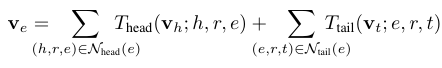

   这里的T函数是非线性函数, 这里使用的是ReLU, 也可以使用 Tanh.

   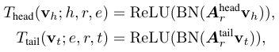

3. **Pooling**

   获取了所有的从不同Head和Tail获取的信息之后, 用Pooling函数将其整合.

   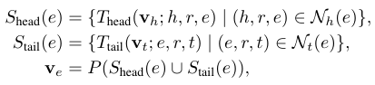

   这里使用的是平均和函数.

   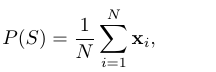

**Relation Embedding**

这里使用简单的初始化. 并在训练过程中变化.

**这样就得到了 $\mathbb{v}_h,\mathbb{v}_r,\mathbb{v}_t$**

##### 2.3.2 stacking GNN

上面只利用了与Entity直接相连的一层数据. 如要使用更加广泛的信息可以通过向下递归实现. 公式为:

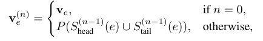

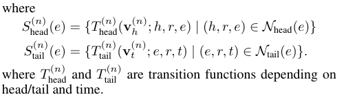

#### 2.4 第二步修改

使用了Absolute-Margin Objective Function.

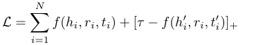

这个方法好在将positive的效果和negative的效果分开.

#### 2.5  预测未知实体

这个在4.3部分, 有兴趣的自己看.

### 3. 结果

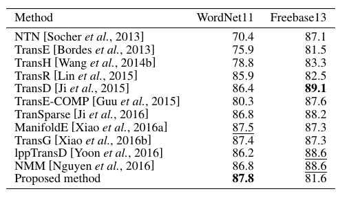

还有在未知Entity上的实验.

