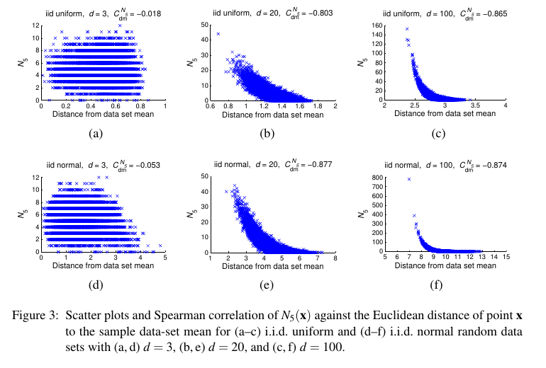
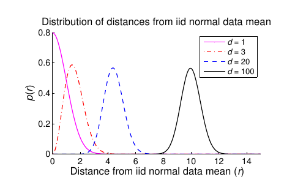
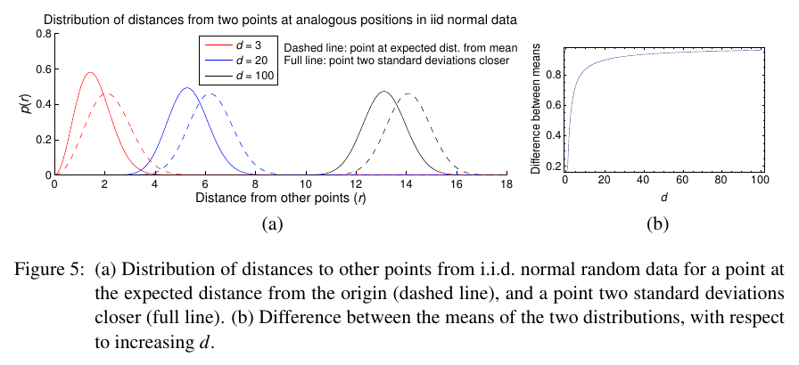
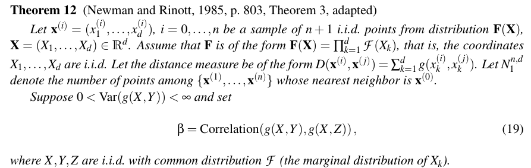
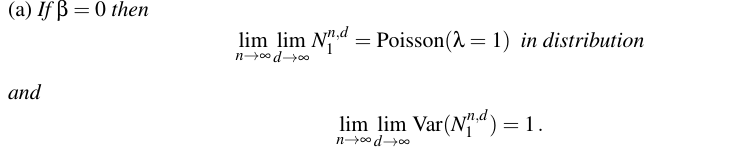
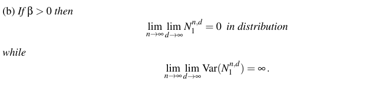
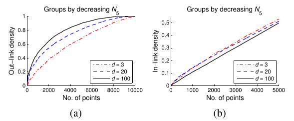
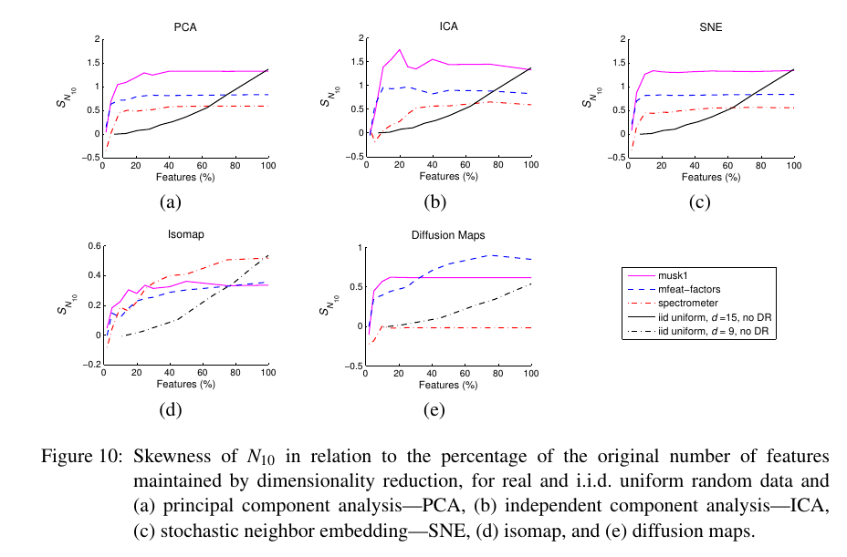

## Hubs in Space: Popular Nearest Neighbors in High-Dimensional Data

### 1. The hubness phenmenon

#### 1.1 Notation

- 向量 : 数据集中的向量 : $x,x_1,...,x_n$, 均从同一分布中生成. 

- 维度 : 设数据集中所有数据 : $x_i \in \mathbb{R}^d$

- K近邻标记 : $p_{i,k}(x)$

  

- 被k近邻数 : 

  

  即, 空间中所有点里面, 把 x 算作k近邻的点. 

#### 1.2 Example - Synthetic data

这里用一个合成的例子去解释什么叫做 Hubness.

##### 1) 合成数据

假设从维度为 d 的 正态/uniform 分布中采样出独立同分布的数据集. 

其中, d=3, d=20, d=100. 

##### 2) 统计量

- $N_5=n$, 即, 目标点被算入5-近邻的次数为n.
- $p(N_5=n)$ : $x \in \{x|N_5(x)=n\}$ 这么一个集合的大小占全部数据的比例.  即被算入5-近邻的次数为 n 的点占全部的比例. 

##### 3) 统计结果

横轴设置为 $N_5$ 的值. 数轴设置为, $p(N_5)$. 统计结果如下:

- 均匀分布的结果

  

- 正态分布的结果:

  

##### 4) 统计分析

- 随着维度的增加, 出现明显的zipf效应. 即, 被算入5-近邻次数很少的点很多. 而, 算入5-近邻次数很多的点很少. 这个同时也可以称作 skewed to right. 

  > 
  >
  > Skew 是用来描述分布倾斜性的一个词汇, 在左边的是 Negative Skew也可以称作 skewed to left 因为, 相比于纯白色区域(虚线)的对称分布, 红色分布向左延伸了. 
  >
  > 右图同理

- 并且 维度升高后, $N_5$ 的值的顶峰值越来越大

也就是说, 随着维度越来越高, 富点越来越富, 但是点数很少. 而穷点还是一样的穷, 但是穷的人很多. 

#### 1.3 Example - Real data

##### 1) 数据集

采用了 50 个不同的数据集, 以下有五个基本属性:

- 点数
- 维度数
- Intrisic dimensions
- classes的数目
- 点和点之间距离 (采用不同的方法:cos, l2 etc. )

##### 2) 统计量

本节暂时使用两个统计量 : 

- $N_k$ , k=10

- 三阶中心距 : 代表了统计量 $N_k$ 的偏度. 
  $$
  S_{N_k} = \frac{E(N_k-\mu_{N_k})}{\sigma^3_{N_k}}
  $$
  ​

  ​

##### 3) 统计结果

- 论文关于50个数据集进行了统计, 每个数据集的 embedding 维度是不同的, 从8-20000不等.

- 最后发现, 所有的 $S_{N_k}$ 都是较高的, 说明都有较高的 hubness 问题. 

- 再以维度为变量, 查看维度与偏度的 spearman correlation 关系, 值为0.62, 已经是有较高的相关性了. 

- Real data 中, Vector dimension 对与 hubness 的影响没有像合成的数据那样强. 原因在下一节中阐述.

- 下面是结果的图:

  

### 2. The Origins of Hubness

第一节定义了 hubness 并且验证了 hubness 的存在, 这一节对 hubness 产生的原因进行阐述. 

分为两部:

- 实证 data points 在 vector space 中的位置分布, 与 其hub性(即N_k数值)的关系. 
- 揭示上一个现象出现的内因, 以及揭示随着维度升高, hubness 越来越严重的原因. 

#### 2.1 The Position of Hubs

##### 1) 实验设计

这里还是采用了合成数据, 包括均匀分布和正态分布两种. 

统计量为:

- 采样结果的 mean
- 每个 x 距离 mean 的距离, $d(x)$
- 每个 x 的 $N_k(x)$

统计的是, $d(x)$ 与 $N_k(x)$ 的关系 $C_{dm}^{N_{5}}$.   

##### 2) 实验结果

统计结果如下:

说明了 : **距离mean越近的点越有可能成为hub点**

#### 2.2 Mechanisms Behind Hubness

##### 1) 卡方分布

卡方分布的公式是(其中 d 是维度):
$$
{\displaystyle f(x;d)={\begin{cases}{\dfrac {x^{d-1}e^{-{\frac {x^{2}}{2}}}}{2^{{\frac {d}{2}}-1}\Gamma \left({\frac {d}{2}}\right)}},&x\geq 0;\\0,&{\text{otherwise}}.\end{cases}}}
$$
其均值就是 :
$$
\mu ={\sqrt  {2}}\,{\frac  {\Gamma ((d+1)/2)}{\Gamma (d/2)}} \sim \sqrt{d}
$$
其方差为 :
$$
\sigma ^{2}=d-\mu ^{2}\
$$

##### 2) 高位数据关于均值点距离的分布

**首先提出一个结论:**

- lying on a hypersphere centered at the data-set mean. 称关于mean为中心的超平面圆周上. 
- 点到 mean 的距离的分布有一个不可忽略的 variance. 这个是当然, 要不然全在圆周上不太现实. 

这两个结果来源于论文 :

> Charu C. Aggarwal and Philip S. Yu. Outlier detection for high dimensional data. 2010 

**其次, 我们看到mean的距离分布的特性:**

如果我们将每个维度看做是一个变量, 那么对于这个多维变量到 mean 的距离, 可以用 chi distribution 来表示, 因为 chi distribution 的意义就是:
$$
\sqrt{\sum_i \frac{(X_i-\mu_i)^2}{\sigma^2}}
$$
所以有一定量的点处在里mean近的地方. 

对于这个现象, 文章也进行了实验, 结果为下图, 可以看到均值与 维度的平方根相关. 

##### 3) mean 距其他点的距离 

- 一个结论

  **这里用到了一个结论:**
  - *高维中点一个点到其他点的距离 与 这个点到mean的距离 呈 d 维 noncentral chi-distribution 关系*

  这个结论来源于论文:

  > Luca Oberto and Francesca Pennecchi. Estimation of the modulus of a complex-valued quantity. Metrologia, 43(6):531–538, 2006.

  这里的 noncentral chi distribution 相比于 chi distribution 就是指:
  $$
  \sqrt{\sum_i \frac{(X_i-\mu_i)^2}{\sigma^2}} \to \sqrt{\sum_i \frac{X_i^2}{\sigma^2}}
  $$
  由于没有减去均值, 所以叫做 noncentral.

##### 4) 实验验证

- **实验设计**:

  对于一个 d 维的分布, 分别统计距离mean 为 $a_d$ 和 $b_d$ 的点, 距离其他所有点的距离信息. 即:
  $$
  D(a_d) = \sum_{i\in N_{a_d}}\sum_{j\in N,j\neq i} D(x_i,x_j)
  $$
  其中,$N$ 是所有点的集合.  $N_{a_d}$ 是距离mean 为 $a_d$ 的点的集合. 

  并且使得 : 
  $$
  b_d - a_d = 2\sqrt{\sigma}
  $$
  也就是, $N_{a_d}$ 是距离更近的点. 

  那么, 通过比较在不同维度下, $D(a_d),D(b_d)$  的差异, 就能比较出结果的不同. 

- **实验结果**

  

  第二个图显示了 均值的 平方根变化性. 

  从结果左图可以看出, 随着维度的上升,  $a_d$ 与 $b_d$ 点与其他点之间的距离的差越来越大.  

  $a_d$ 是属于距离较小的, 证明了:

  **高维点中, 离mean越近的点, 与其他点的距离就越近.** 

##### 5) 实验结果分析 - 中心性

这里使用了 **空间中心性** 的概念去解释, 这里的 KNN 其实相当于网络的 degree centrality. 

### 3. Hubness in Real Data

Real data 与合成的 data 有不同的地方, 这些地方会大致验证失败. 

- Real data 的 points 之间有一些依赖性. 
- Real data 具有 clustering 性, 即不是单峰, 而是从多峰分布中采出的. 

#### 3.1 依赖性的影响

使用的数据集的 vector dimension 其实不是 他们的真实的 dimension, 而应该使用 instrinsic dimension. 这里采用的先行研究中的方法去计算 instrinsic dimension.  论文是:

> Jean-Julien Aucouturier and Francois Pachet. A scale-free distribution of false positives for a large class of audio similarity measures. Pattern Recognition, 41(1):272–284, 2007.
>
> 另外本论文引用了相当多的这篇论文中的东西, 如果有兴趣可以看看.

简单来说, 就是每个 data 都有一些属性(属性是可以共用的), 通过将这些data 的属性 shuffle 后, 就可以得到除去影响的结果. 

$S_{N_k}^S$ : 关于 instrinsic dimension 下的向量做一个 倾向度(三阶矩)统计. 结果显式, 随着 dimension 上升, 偏度越来越大. 

#### 3.2 Clustering

这里简单用 k-means 找到合适的类别, 再计算这个类别内的点到类别内均值的距离.  

这个指标记录为 $C_{cm}^{N_{10}}$. 这里也对不分类的情况下进行了统计 $$C_{dm}^{N_{10}}$$

结果显示, 分类的相关性(距中心点距离, 被K近邻次数) 具体见 2.1.1.

#### 3.3 Instrinsic dimension 

这里给出了一个新的统计量, 叫做 : $d_{mle}$ 用来表示 instrinsic dimension. 

是通过MLE实现的, 这个才是其内在维度, 真实维度, 发现 $N_k$(被近邻次数) 与 内在维度 具有极强的相关性. 

### 4. Discussion

#### 4.1 Hubs and Outliers

在上面的图中, 尾部的点其实本质就是 outlier 点. 

hub 点是, 在低密度区域的, 距离所有点都近的点. 

outlier 点是, 在低密度区域的, 距离所有点都远的点. 

#### 4.2 Theorem by Newman

##### 1) 一些定义

之前, 我们对数据的距离的计算都是基于关于 mean 的绝对距离的, 这个定理是关于任意几个点之间的相对距离而言的. 

假设高位空间中有三个点, $X,Y,Z$ , 是从一个分布总采样出的独立同分布的点. 

这三个点关于 mean 的远近其实不重要, 重要的是他们之间是否在**一个方向**上, 比如说, 二维空间内, 等边三角形的三个点就不是在一个方向, 而一条直线上的三个点就是在一个方向上. 而去衡量这个性质的统计量, 是各个点之间关于维度的相关性. 

假设 : $X=(x_1,..,x_d), Y=(y_1,...,y_d) , Z=(z_1,...,z_d)$, $g(x_i,y_i)$ 为 $x_i,y_i$ 之间的某种位移度量(有方向). 

那么, 通过统计 $g(x_i,z_i),g(x_i,y_i)$ 关于维度为变量的相关系数就可以得到这三个点是不是有个方向. 

在 Theorem 中的定义如下:

##### 2) 结论

如果没有相关性, 也就是说, 高位空间中的所有点呈现均匀分布. 例如, 均匀的分布在一个 hypersphere 上的话. 即 $\beta=0$ 的情况, 对于每个点而言, 其被近邻数符合泊松分布:

反之, 如果不是这样的话:

也就是说, 随着 点数 和 维度值 的增加, 会有越来越少的点有被近邻的点. 但是要注意的是, 所有的点还是有 k 的近邻点被算入, 也就是说, 随着点数的增加, 边的数目还是不变的. 因此, 被近邻的边越来越多的集中到一小部分点上. 

##### 3) 证明

这个证明是 Newman 的文章中提到的. 

Charles M. Newman and Yosef Rinott. Nearest neighbors and Voronoi volumes in high-dimensional point processes with various distance functions. Advances in Applied Probability, 17(4):794–809,1985.

#### 4.3 Nearest-Neighbor Graph structure

##### 1) Insight 

下面是从 graph 的角度去理解和证明上面的结论. 

说实话, 这里的过程没有怎么看懂, 但是大概意思差不太多. 

这里, 将从 uniform 分布采样出的点全部当做 节点看待. 将 被近邻关系当做边. 

即: **如果 A 是 B 的 K 近邻点, 就会有一条从 A 到 B 的边.** 

这里再定义两个 network 中的概念:

##### 2) Out-link density and In-link density 

- Out-link density:

  分子 : 一个子图中, **起点和终点**均在这个子图中的边的数目. 

  > 即, 一个子图中, 互相近邻的边的数目

  分母 : 一个子图中, **起点**在这个子图中的边的数目. 

  > 即, 这个子图所有点 被当做近邻点的次数. 

  Density : 分子/分母

- In-link density:

  分子 : 一个子图中, **起点和终点**均在这个子图中的边的数目. 

  > 即, 一个子图中, 互相近邻的边的数目

  分母 : 一个子图中, **终点**在这个子图中的边的数目. 

  > 即, 这个子图中的点的发出的近邻边, 这里就是 K*N. 

  Density : 分子/分母

##### 3) Graph Groups

论文中按照点的被近邻数, 将所有点从高到低排列, 然后从 $N_k$ 最大的点开始, 逐步向其中加入新的点. 这个不断加入新的点组成的新的子图就是 自变量. 因变量是关于对应的子图的 density. 

##### 4) Exiperment and Result

结果如下:

分析如下:

- Out-link density :

  可以看到, 随着维度的上升, 斜率的函数从常数变为了递减函数.

  说明, 随着维度的上升, 越来越多的点将其近邻投向高 $N_k$ group. 

- In-link density

  这里说明, 纬度越高, 高$N_k$ 的点 越倾向于连向外部的点.

#### 4.4 Hubness and Dimensionality Reduction

##### 1) 实验介绍

这个实验是探究 Hubness 和 维度下降 的关系. 即, 维度下降是否可以减轻hubness 问题. 

这个地方的实验是通过维度下降法去下降不同的维度, 最后看 同一数据集在不同维度下的 偏度 $S_{N_{10}}$. 这里采用了五种维度下降法, 结果如下:

##### 2) 实验结果

可以发现, 在大部分维度还保存的情况下, 基本上没啥影响. 

但是到了一定下降程度后, 偏度急速下降, 这个下降就是到达了 instrinsic dimension 的标志. 

结果显式, 在不损失信息的情况下, 下降维度基本上是没有影响的, 虽然到了 instrinsic dimension 之后会下降, 但是小于 instrinsic dimension 的维度会损失大部分的信息. 

### 5. The impact of Hubness on Machine learning

#### 5.1 On Supervised learning 

有心情再写吧. 