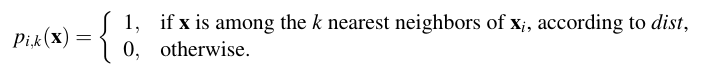
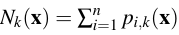
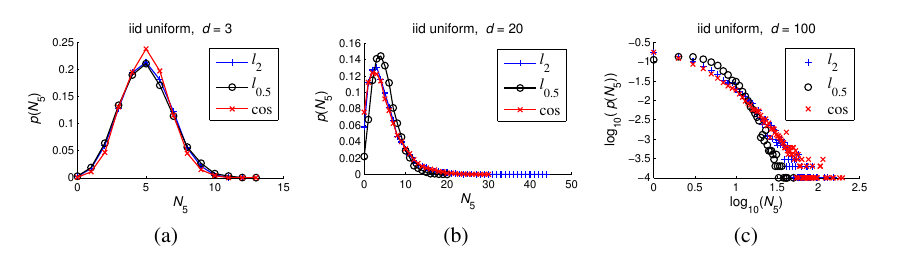
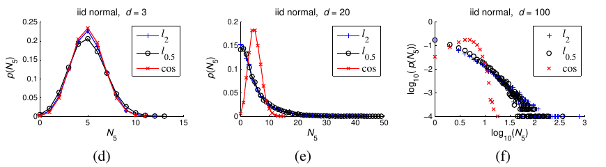
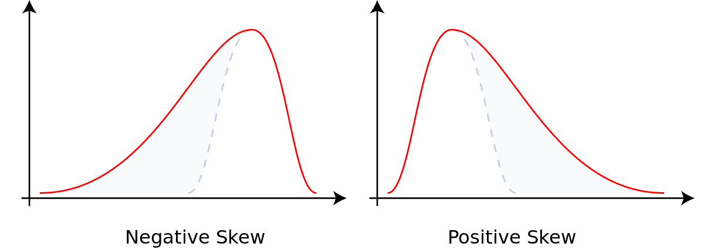

## Hubs in Space: Popular Nearest Neighbors in High-Dimensional Data

### 1. The hubness phenmenon

#### 1.1 Notation

- 向量 : 数据集中的向量 : $x,x_1,...,x_n$, 均从同一分布中生成. 

- 维度 : 设数据集中所有数据 : $x_i \in \mathbb{R}^d$

- K近邻标记 : $p_{i,k}(x)$

  

- 被k近邻数 : 

  

  即, 空间中所有点里面, 把 x 算作k近邻的点. 

#### 1.2 Example - Synthetic data

这里用一个合成的例子去解释什么叫做 Hubness.

##### 1) 合成数据

假设从维度为 d 的 正态/uniform 分布中采样出独立同分布的数据集. 

其中, d=3, d=20, d=100. 

##### 2) 统计量

- $N_5=n$, 即, 目标点被算入5-近邻的次数为n.
- $p(N_5=n)$ : $x \in \{x|N_5(x)=n\}$ 这么一个集合的大小占全部数据的比例.  即被算入5-近邻的次数为 n 的点占全部的比例. 

##### 3) 统计结果

横轴设置为 $N_5$ 的值. 数轴设置为, $p(N_5)$. 统计结果如下:

- 均匀分布的结果

  

- 正态分布的结果:

  

##### 4) 统计分析

- 随着维度的增加, 出现明显的zipf效应. 即, 被算入5-近邻次数很少的点很多. 而, 算入5-近邻次数很多的点很少. 这个同时也可以称作 skewed to right. 

  > 
  >
  > Skew 是用来描述分布倾斜性的一个词汇, 在左边的是 Negative Skew也可以称作 skewed to left 因为, 相比于纯白色区域(虚线)的对称分布, 红色分布向左延伸了. 
  >
  > 右图同理

- 并且 维度升高后, $N_5$ 的值的顶峰值越来越大

也就是说, 随着维度越来越高, 富点越来越富, 但是点数很少. 而穷点还是一样的穷, 但是穷的人很多. 

#### 1.3 Example - Real data

##### 1) 数据集

采用了 50 个不同的数据集, 以下有五个基本属性:

- 点数
- 维度数
- Intrisic dimensions
- classes的数目
- 点和点之间距离 (采用不同的方法:cos, l2 etc. )

##### 2) 统计量

本节暂时使用两个统计量 : 

- $N_k$ 
- $S_{N_k}$

##### 3) 统计结果

