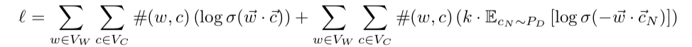
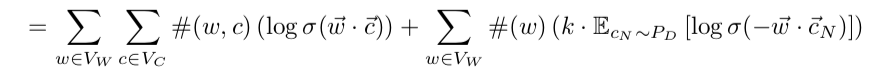
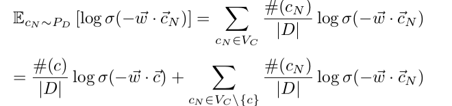
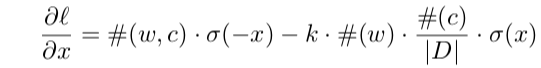
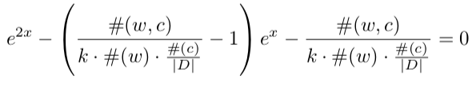
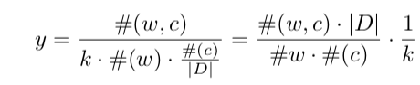
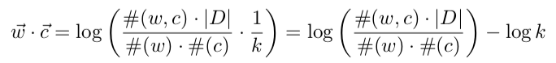
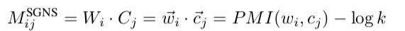
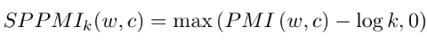
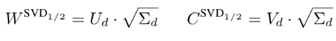

## Neural Word Embedding as Implicit Matrix Factorization

### 0. Abstract

- 分析显示,word2vec(SGNS)实际上是对一个word-context矩阵的分解,里面的每一个cell都是word-context的互信息经过一个shift之后的表达.

- NCE模型中的词向量也是隐式的分解的这样一个类似的矩阵,每个cell里面是  $log(p(word|context))+b$

- 论文提出了一个利用了Shifted Positive互信息的系数word-context矩阵的词向量方法,这个方法相比于上面两个方法而言,在文本相似度的任务上得到了提升,在词类比任务上比一个要好.

  当把这个稀疏的方法利用SVD进行压缩后,在相似度任务上得到了和SGNS一样的结果,但是在类比任务上,SGNS的效果要更好一点,论文分析原因是因为SGNS的**加权特性.**

### 1. Introduction

- **distributional hypothesis of Harris**

  The **Distributional Hypothesis** in linguistics is the theory that words that occur in the
   same contexts tend to have similar meanings

- 关于词向量的研究都是基于词汇-文档矩阵模型,在此之上才有了dense vector的各种基于神经网络的词向量.这些模型的特点都是试图最大化经常出现在一起的词汇的点乘,然后最小化随机的点乘,

- 这篇论文的任务就是找到关于神经网络下训练出词向量的理论理解.这里,它将SGNS的方法看作是一种加权矩阵的分解.然后我们会发现他的目标其实是隐式的分解一个shifted PMI matrix.

- 为了证明自己的正确性,论文使用了shifted PMI matrix去证明两者的等价性,但是由于某种原因,直接使用高位度的dense shifted的PMI矩阵是不切实际的,因此这里将shifted PMI简化成了shifted positive PMI->shifted PPMI.结果这个词向量的结果在各种语言学任务上的结果比word2vec都要好.

- 论文使用了一个简单的谱算法,(基于PPMI的SVD)的处理,结果显示这个结果在词汇相似度任务上比SGNS还有word2vec都要好.但是在词汇类比上的结果没有那个好,原因分析如下:

   However, it lags behind the SGNS-derived representation on word-analogy tasks.  We conjecture that this behavior is related to the fact that SGNS performs **weighted matrix factorization**, giving more influence to frequent pairs, as opposed to SVD.

  也就是说,原因是在于PPMI的算法对于所有的cell分布的权重是一样的,而SGNS是有偏重的?也就是没有考虑到词汇本身的数量问题.为了理解这个意思,先看下互信息的公式:

  $log\{p(w_1,w_2)/p(w_1)p(w_2)\}$ 

### 2. Background: Skip-Gram with Negative Sampling (SGNS) 

看word2vec笔记.

### 3. SGNS as Implicit Matrix Factorization

论文,设有词汇-文档矩阵,M,v\*d. 通过神经网络训练后的词向量矩阵W的大小为 v*d ,v 是词汇数量,d是词向量长度. 而文档的意义向量为这里面所有词汇的平均,那么文档向量C的大小为 c\*d,其中c为文档数目.那么是不是可以认为 W和C 是通过M经过某种分解得来的呢?

即使假设了已知分解的方法,还要知道的一点是,原先的 M矩阵中储存的是什么信息,也就是每个cell中储存的是word和文档的什么信息?设每个cell里的值可以通过f(w,c)来表示.下面来看.

#### 3.1 Characterizing the Implicit Matrix

首先来定义几个符合含义:

D : 从语料库中抽出的所有共现词汇对,有重复的,不是集合

k : SGNS计算中采用的负采样数

$V_w$ : 目标词汇集

$V_c$ : 与目标词汇共现的词汇集

w : 目标词汇

c : 与目标词汇共现的某个词汇

$c_n$ : 负样本中的词汇

\#(w,c) : w与c共同出现的次数

那么,我们本身的SGNS的loss计算公式为:

可以转化为:

其中,

接下来去看具体的一个词对 (w,c) 的 loss值,并且由于我们的目的是看SGNS是以什么信息作为标准对模型进行优化的,因此我们只需要关注 含有 $\vec w \cdot \vec{c} $ 的项就好了,也就是:

进行求导:

求导后使结果等于0:

设 $y=e^{2x}$ 后:

得出结果:

其中, 结果的第一项是互信息!!:

也就是说,SGNS的word-docu的矩阵中,储存的是互信息的偏移值.

根据同样的方法得出来,NCE的最后公式是:

#### 3.2 Weighted Matrix Factorization

可以将SGNS看作是一个加权矩阵的分解问题.

#### 3.3 Pointwise Mutual Information

在分解互信息矩阵的时候,会遇到一个很严重的问题,就是 #(w,c) 为0的情况,这种情况下 log(PMI) 是负无穷,很惨.因此演化出了PMI矩阵的两种变体:

$M_0^{PMI}$:  $PMI(w,c) = 0$ in cases $\#(w,c) = 0$  ,不过这种情况下我们会发现, 对于某些碰巧在一起的词汇组而言,这样的结果是非常不好的. 例如对于两个词,其只共现一次的PMI是一个特别小的负数,说明了,两个词汇非常不倾向与在一起.但是,当两个词汇不再一起的时候,其结果反而变成了0,比共现频率为1的PMI值还大了好多,这种不标准性是不好的. 

$PPMI(w,c)$:而这个弥补了上面的那个缺点,: $PMI(w,c) = max (PMI(w,c),0)$

其实从认知上讲,我们对于词义的理解,只是来源于其一起共现的词汇,而不会去注意不在一起共现的词汇,所以,这里索性将所有PMI小于0的数都看作不相关,也就是其随机出现.这个就弥补了上面的问题.

而,通过分析我们知道了 SGNS是用的普通的PMI矩阵,这样说的话,PPMI的结果应该更好一些?

### 4. lternative Word Representations

介绍两种基于 $M^{PPMI}$ 的词向量获取的方法:

#### 4.1  Shifted PPMI

负采样的数量对结果的影响很大.建立新的矩阵:

具体的样本数是task-specific

#### 4.2  Spectral Dimensionality Reduction: SVD over Shifted PPMI

利用谱方法对矩阵进行降维获取其主要信息.

- **普通SVD**

  这个方法就不介绍了,详见深度学习第二章

- **Symmetric SVD**

  通过SVD分解出来的结果显示,文档矩阵是正交的,而词向量矩阵不是正交的.而SGNS的结果中,两个都不是正交的,因此通过一个变换,使得两个矩阵的正交性得以平衡:

  

  不过也只是实验显示这样的结果比较好,不过没有理论证明.

- **SVD vs SGND**

  接下来比较两者的优缺点:

  - **SVD的优点:**
    - does  not  require  learning  rates  or  hyper-parameter  tuning
    - it can be easily trained on count-aggregated data (i.e.{(w,c,#(w,c))}triplets), making itapplicable to much larger corpora than SGNS’s training procedure,
  - **SGNS的优点**
    -  it distinguishes between observed and unobserved even,这个是因为采用的PPMI矩阵
    -  SGNS’s objective weighs different (w,c) pairs differently, preferring to assign correct values to frequent(w,c)pairswhile  allowing more  error for  infrequent pairs . 这个是因为,在SGNs中出现次数多的词汇得到了更多的训练,而在SVD中只得到了一个最后的互信息值,这个是最大的也是最重要的不同.并且因为在SVD中加入词频信息的话就会变成一个难问题,因此不可行.
    - SVD中加入负样本信息后,矩阵会变成了dense矩阵,会难以计算.但是在SGNS中就不会有这个问题.

- **stochastic matrix factorizatio**

  一个SGNS和SVD的trade-off.有两者的优缺点.

  ​