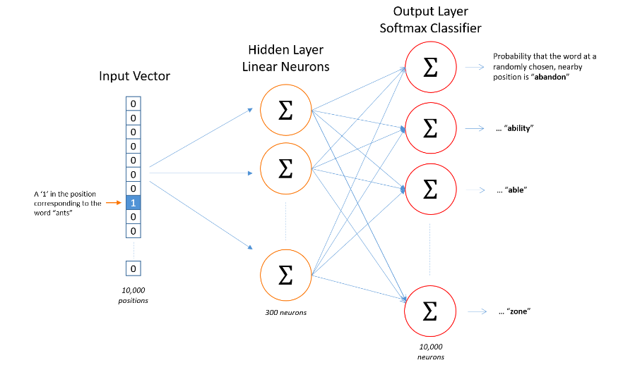
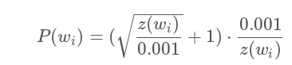
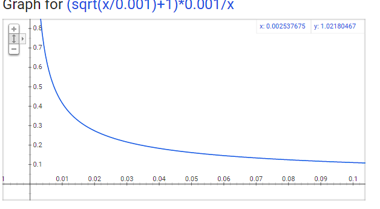

## Word2vec

**这篇笔记主要基于 [博客](http://mccormickml.com/2016/04/19/word2vec-tutorial-the-skip-gram-model/) **

### 1. Insight

这篇论文的核心,在于:不同于其他的模型,本模型训练神经网路的目的不是利用模型做出的预测结果,而是使用神经网路的中间参数作为词向量.

这是一种无监督特征学习的方法.

### 2. The Fake Task

之所以称之为Fake,是因为,训练模型不是我们的目的,目的是取训练后模型的hidden layer参数.

大致做法如下:

- 给出在一个句子的某一个词汇,找出其邻近的窗口词汇,组成多组词对
- 训练方法是,输入一个词汇,输出这个词汇与全部词汇共同出现的概率.而用真实的共现概率去做代价函数

### 3. Model Details

先上图:

**模型具体细节是:**

- 输入层为one-hot向量,维度为词汇集的数量
- hidden layer是一个简单的无偏移的线性单元,就是 $H_i=W_i^TO_i$ , 这里的 $O_i$ 就是one-hot向量, $H_i$ 就是hidden layer的权重,也是我们要使用的词汇向量.
- output layer是softmax函数,输出的是一个概率分布,维度也是词汇集的数量. $P_i = softmax(W_o^TH_i)$ .这里的 $W_o^T$ 是output layer的权重, $P_i$ 是单词 $i$ 关于全部词汇的预测概率分布.

**维度描述:**

- 假设词汇集中的词汇数目为10000.那么 $O_i$ 就是一个长10000维的向量,其中只有一个值是1,其他都是零.
- 我们假设要训练的每个词汇的词向量维度为300的话,那么 $W_i$ 的大小就是 $10000*300$ .那么$H_i=W_i^TO_i$ 的过程就是一个look up的过程.
- 下面的也就不解释了

**一个问题:**

这里的一个问题是,在训练的时候我们知道了一共要训练两个权重矩阵,一个是hiddenlayer一个是output layer.那么我们为什么只使用hidden layer中的参数,而不使用output layer中的权重呢?

根据[QA](https://stackoverflow.com/questions/46065773/why-we-use-input-hidden-weight-matrix-to-be-the-word-vectors-instead-of-hidden-o)上的问答,答案如下:

将原始one-hot向量转化为hidden层的过程是一个编码过程,也就是说这一步的实际含义是,*对每一个词汇编码*,也就是编码的是词汇的**语义信息**.而后面的输出,我们是用来统计其上下文信息的,因此其权重储存的是**上下文信息**.因此我们要使用的是hidden layer的权重.

**->** 问题:训练的参数过多,难以实现训练,这就是下一步要做的工作

### 4. Three innovations

#### 1. Word pairs or phrases 

具体做法很简单:

设词A出现的频次为 $P_A$ , 词B出现的频次为 $P_B$ . A和B在一起出现的频次为 $P_{A,B}$ . 语料库中的词汇总数为 $|V|$ . 那么分数为:

$|V| * (P_{A,B}-minicout)/(P_A*P_B)$

这里的 minicout实际就是一个阈值,乘以词汇总数的原因是,希望分数的结果可以与语料库大小无关.

(总感觉这个方法略显简单)

#### 2. Subsampling frequent words 

计算sampling rate:

其中 $z(w_i)$ 是词汇 $w_i$ 占语料库的百分比. 而 $P(w_i)$ 是指subsampled的百分比.

图像如下:

#### 3. Negative Sampling

- 原理

  在正常的训练中,我们需要对输出的每一个单元进行反向传递.这对于一个拥有300\*10000\*2个参数的神经网络,不仅需要大量时间,还需要提供不切实际的大小的语料库才可以.因此,这里采用的方法是,每次只更新几个词汇的权重,其中包括一个target word和几个negative word.这里的negative word的意义是,这几个词汇的真实标签是0.一般对于小的语料库,negative word的数量可以选取到5-20.而对于大型的,只需要2-3即可.

- 如何选取negative word

  这里论文给出了一个公式:

  

  这里算得就是在每次选择的过程中选取negative word词汇的概率分布.

  需要注意的是,这里不是简单的线性百分比.而是经过了一个向上的弧度微调,使得高频的词更容易被选.

- 具体的实现

  计算出每个词汇的 $P$ 之后 , 找一个合适的基数,按照比例,建立一个超大的数组,数组中填充重复的词汇.然后通过随机选取index的方法选择negative word.

  ​

### 5. Hierarchical softmax

论文中使用了Hierarchical softmax 来代替 softmax. 这里的 Hierarchical softmax 是很有意思的一个算法,详细说明见 [博客](http://ruder.io/word-embeddings-softmax/) . 详细笔记见, note:hierarchical softmax

这个方法是一个算法优化,对速度有影响,对结果没有影响,并且这个算法使用不当在效果会差于正常的softmax.

这个方法的最大优点是在训练好的模型上进行预测的时候的加速.对于一般的训练过程而言,没有太大意义.

但是,这个方法在这个模型的训练上是有优点的,因为这个模型使用了Negative sampling方法,因此,每次只需要计算n+1个词汇的softmax值就可以,而softmax是需要将所有的词汇的softmax值算出来之后再做一个除法.因此,如果不使用Negative sampling方法的话,于训练过程无太多优点.

### 6. Experiment Detail 

- 采用的数据集是来自google内部的超过十亿的数据库.

$\\mbox{path}(x) = ((e_1, b_1), \\dots, (e_m, b_m))$