## Deep contextualized word representations

### 1. Introduction

- **什么是一个好的词向量**

  - 能够反映出语义和语法的复杂特征.
  - 能够准确的对不同上下文进行反应.

- **deep contextualized 词向量的特点**

  - **使用理念方面:**

  在原先的词向量模型中, 每个词对应着一个向量, 但是这个模型是根据一个句子赋予每个词汇向量. 因此对于一个 n-tokens 的输入NLP任务模型, 输入到NLP任务模型的是n个向量. 这个论文中提出的方法, 是在NLP模型的输入之前需要再加一个动态计算词向量的前向网络, 我们称其为BiLMs, 而这个前向网络是提前在一个大的数据集上训练好的. 而这个前向网络的输入是n个更初始的词向量.

  - **训练具体信息:**

    关于这个网络更加详细的信息见第三节. 简单来说是一个多层的双向LSTMs结构, 称其为BiLMs模型过.

  - **效果方面:**

    经过测试发现

    - BiLMs的较高层次的隐藏单元的向量很好的抓住了词汇的意义表示, 并且**在很多任务上不用再次对词向量进行调整就可以得到一个不错的结果.** 
    - BiLMs的较低层次的隐藏单元的向量很好的抓住了词汇的语法信息, 可以在例如词性标注的任务上发挥其作用.

    这种深度模型所带来的分层效果使得, 将一套词向量应用于不同任务有了可能性. 因为, 每个任务所需要的信息多是不同的.

    在六个任务上进行了测试,都发现好于最佳结果.

- **CoVe向量**

  这里简单提一下这个词向量, 这是一个利用翻译编码器去获取上下文词向量(也就是输入为句子, 再对每个位置的词汇赋予词向量的这种动态的词向量赋予方式). 因为下文中一直与它进行对比.

### 2. Related work

忽略

### 3.  ELMo: Embeddings from Language Models

ELMo word representations are functions of the entire input sentence.

3.1 - 基本单元是一个两层的基于字符卷积的网络.

3.2 - 讲了内部状态的组合构成新的词汇向量表示.

3.4 - 讲了一些训练BiLMs的基本设置.

3.3 - 讲了如何将该BiLMs词汇向量模型添加到到实际NLP task

#### 3.1 Bidirectional language model

- **关于双向**

  双向模型的公式如下:

  

  从这个公式中我们就可以看出, 向左和向右的LSTM是不同的, 也就是说有两个LSTM单元. 

   $\theta_x$ 是输入的意思. 输入的内容是最初始的词向量.  $\theta_s$ 是输出内容, 即LSTM在每个位置的 h. h会再用作softmax的输入, 来进行词汇选择权重赋予.

  但是, $\theta_x$ 和 $\theta_s$ 是相同的, 意味着这两个单元的输出和输入都是相同的.单层的双向LSTM如下:

  

  那么, 这里设定第 j 层的第 k 个位置的forward LSTM(也就是右向LSTM)输出为 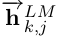

  那么, 左向就是 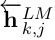

  Input, 也就是最原始的词向量为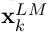

  那么, 这个最原始的词向量是怎么获得的呢?前面提到了, 是通过字符卷积, 大概是这个样子:

  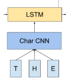

- **关于深层**

  首先要知道这是一个深层双向LSTMs网络, 层数为L, 大概的感觉如下:

  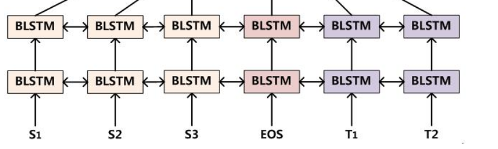

  这里展示的是一个双层, 即L=2的情况.

  也就是说, 每个位置的输出在输入到下一位置的同时, 也作为下一层的同一位置的输入. 

#### 3.2 ELMo

上面说到了, LSTM的每一层都有自己不同的代表的意义, 因此,对于不同的任务, 每层参与表征的权重也就不同, 因此, 为了一般化, 该方案设置一个通用词向量表征法, 即 利用每层状态的线性组合.

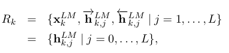

这是线性组合的单元集合.

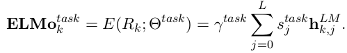

其中,s就是softmax-normalized weights , 也就是加和为1的一组权重向量. 这组权重不仅仅代表的是权重, 因为每层LSTM内部状态,也就是 h 的分布是不同的, 这个也可以用作layer normalization. 

> PS : 原文中有关获取s值的方法的描述很简单:.$s^{task}$ are softmax-normalized weights.
>
> 我个人意见(真的是个人意见)是, 就是在每一层中多一个参数, 我称之为s位, 设第 i 层的s位为 $s_i​$. 用来作为计算 $s^{task}​$ 的输入. 计算方法是: $s_i^{task} = e^{s_i}/\sum_j^Ne^{s_j}​$
>
> 因为这个 $s^{task}$  是一个模型的参数,是独立于词向量的,也就是说不会随着输入词的改变而改变 . 所以应该不会以每层的隐藏状态作为输入(因为每层的隐藏状态会随着词向量改变). 所以, 在利用语言模型进行初始化的过程中, 应该会将每层中的s标志位设置为相同的值, 这样经过softmax转换后的值也是一样. 

而, $\gamma$ 允许具体的task模型去放缩 ELMo 的大小. 这个地方非常重要, 作者在补充中进行了强调, 在没有这个的情况下, 只采用该模型的最后一层输出作为词向量的时候的效果甚至差于 baseline. 这个重要的原因是, BiLM的内部表征和具体任务的表征的分布是不一样的.

#### 3.3  Using biLMs for supervised NLP tasks

- **最简版使用方法**

  将该词向量加到一般的任务的方法是, 先固定一个权重, 构成一个 $ELMO_t^{task}$  , 然后联结 $ELMO_t^{task}$ 和 最初始词向量(也就是通过字符卷积获得的向量) 为 [$x_k;ELMO_t^{task}$], 然后将这个向量输入到任务的RNN模型中去.  然后在训练中一同训练权重因子

- **加强版**

  我们可以在output处也加一个这样的向量,即 $[h_k;ELMO_t^{task}]$, 不同是,这里应该采用与输入 $ELMO_t^{task}$ 中不同的权重因子. 

- **终极版**

  可以在ELMo模型中加入dropout, 以及采用 L2 loss的方法来提升模型.

  并且, 这里的 L2 项的系数 $\lambda$ 越大, 越有取各层平均值的意思, 越小, 越可以发挥各个层之间的不同带来的效果. 但是并不是说, 越小越好.

  ​

#### 3.4 Pre-trained bidirectional language model architecture

现在进入真正重要的部分, 也就是如何训练这个 ELMo 网络的问题.

- **模型结构**

  这里采用的还是语言模型去训练网络. 并且这篇的模型是有借鉴先行研究的. 

  Exploring the limits of language modeling.

  Character-Aware Neural Language Models

  这两个先行研究都是基于字符卷积网络来做的, 但是这其中有一个问题是字符卷积网络的低效问题, 详细见[论文](From Characters to Words to in Between: Do We Capture Morphology?). 通过这篇论文我们也知道, 能够实现最大效率利用字符共现来表达词义的网络就是 biLSTMs 网络, 这也是为什么这个模型采用这个网络的原因.

  但是不同于这两个论文的是, 这个论文增加了

  - 使得模型可以同时训练双向参数的
  - 增加 LSTMs 单元之间的残差连接(见笔记, 残差网络). 简单说, 就是一种简化训练,提升在深层网络下训练效率的方法.

  并且, 这里使用的是 BIGLSTM , 也就是说模型的 size 特别大. 这个主要是从 Exploring the limits of language modeling 中学得的.  

- **模型参数**

  最终的模型参数如下, 这些参数的示意都在 (Exploring the limits of language modeling) 这篇文章中,由于篇幅较长, 见最后的补充部分.

  - 是一个两层的LSTM, 每层的LSTM cell拥有4096个单元(即hidden state) 和512维度映射(即lstm cell 的output). 
  - 从第一层到第二层存在一个残差连接
  - context insensitive type representation uses  2048  character  n-gram  convolutional  filters followed by two highway layers. 也就是说使用了2048个过滤器, 来进行基于字符的卷积计算.
  - a linear projection down to a 512 representation. 也就是一直在说的各层输出的线性组合.

  最后的结果是, 整个模型针对一个token, 可以产生三个向量, 原始 $x_k$, 第一层以及第二层.

- **其他**

  另外一个重要的点, 在各任务中对BiLMs进行fine tuning可以取得很好的效果.

### 4. Evaluation

论文从 Question  answering, Textual  entailment, Semantic role labeling, Coreference resolution, Named  entity  extraction, Sentiment analysis 六个人物来验证, 都取得了提升.

### 5. Analysis

---

> ablation analysis:
>
> 这个其实就是控制变量法, 我们的模型通过自动调整得到了大量参数, 但是我们不知道那些参数更重要一些, 因此我们通过设置有某变量的一组实验和无该变量的一组实验来进行比较, 得出不同参数对应的重要度. 通过这样的实验, 就可以使得开发者的注意力主要集中在重要的参数上.

----

#### 5.1 Alternate layer weighting schemes

上面说过, L2 loss的系数 $\lambda$ 给模型带来的影响, 就是, 其值越大, 最后的 $ELMO_t^{task}$ 越趋近于各层之间的平均值. 下面是对四个不同的构造进行的比较, 

- 第一列是baseline模型(使用普通的词向量, 例如 CoVe) 
- 第二列是只使用了 BiLSTMs 最后一层输出的结果. 
- 第三列是使用了各层次状态值平均的结果(倾向于平均, 并非完全平均, $\lambda=1$)
- 第四列是使用了各层次状态值加权和的结果($\lambda=0.001$)

其结果如下:

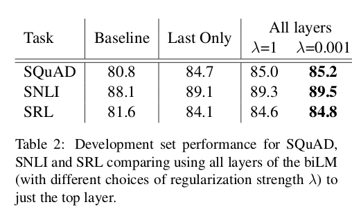

#### 5.2 Where to include ELMo?

上面也提到了要在output的地方也加入 ELMo 来进行训练.  但是这样做真的好嘛?本节针对这个进行了实验, 实验结果如下:

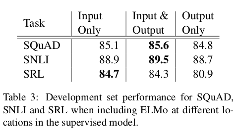

证明确实是有效的.

#### 5.3 What information is captured by the biLM’s representations?

上面的模型比较是将ELMo的整个结果加入一个具体的NLP task , 与其他模型比较, 而在这一节是通过, 取 ELMo 的单层出来的词向量加入模型与其他不同的词向量加入模型进行对比.(注意, 这里的模型并没有保证一致性, 但是ELMo加入的模型设计简单, 在这种情况下依然可以取得好结果, 说明效果不是出自模型,而是出自向量.)

- **Word sense disambiguation**

  语义消歧任务, 这里使用了 SemCor3.0 这个预料库, 这是一个标注了多义的预料库, 库中的每个词汇都对应着 wordnet 的一个位置. 

  基于该预料库进行计算的方法是, 先利用 BiLMs 来计算出了语料库中所有的词汇向量表示. 然后将位于wordnet相同位置的词汇的向量取了平均. 测试的时候, 对于一个给出的target word in a target sentence. 利用 BiLM 得出结果后, 利用训练时获得的每个wordnet位置中的词汇的初始向量, 再利用 1近邻法求这个词汇可能的位置. 这个模型本身可以说是非常简单了, 只用到了 1-近邻. 但是结果还是显示, 有很高的F1值. 如下图:

  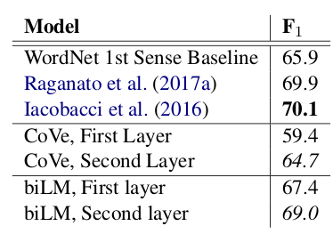

  通过这个表也可以知道, 第二层的语义信息要高于第一层.

- **POS  tagging**

  上面的结果测试了 ELMo 表达语义的效果, 接下来利用 POS tagging 检测其对语法的表达效果.

  这个是用向量作为输入进一个分类器, 去分辨词性, 也可以说是非常简单了. 其结果如下:

  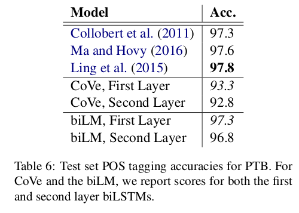

  可以说是灰常强了. 顺便说下, 这里用的训练数据是  Wall Street Journal portion of the Penn Treebank.

- **Implications  for  supervised  tasks**

  不同层次的数据具有不同的意义这一点, 使得其 ELMo work.

#### 5.4  Sample efficienc

这个有点厉害. EMLo 真的是又快又强. 堪称词向量界的大表哥.

- **快**

  在不加 ELMo 的情况下去训练 SRL model , 达到最佳 F1 值要在 486 个epoch之后, 但是!!!!!在加了 ELMo 之后, 只需要十个回合便超越了原来的 F1 值. 降低了98%的时间消耗, 神了.

- **强**

  在使用更少数据下便可以能够获得同样的效果.

  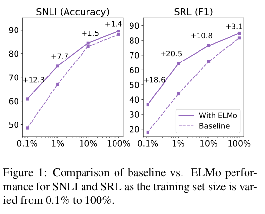

  从这个图中就可以看出来. 虽然最后趋于一致,但是在数据量较少的情况下, 带来的进步是很大的.

#### 5.5  Visualization of learned weights

这一节视觉化展示了在不同任务中, 不同层次所分配到的权重, 不过不知道怎么想到, 这个图真的不好看....

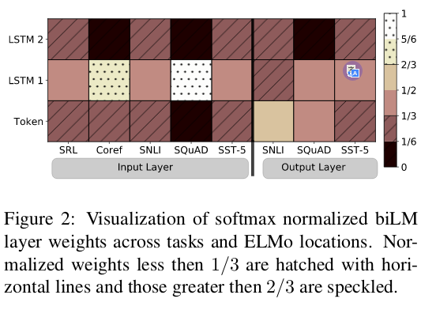

### 6. Supplementary

这里主要补充被该论文一概而过, 但是又极其重要的部分.

主要基于两篇论文:

- Character-Aware Neural Language Models
- Exploring the Limits of Language Modeling

#### 6.1 Character-CNN

首先要知道, 基于字符的CNN到底是个什么样子, 上面虽然有个简图,但是不详细. 

在Character-Aware Neural Language Models的论文中, 结构图如下:

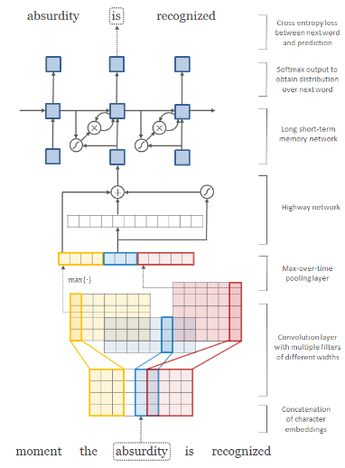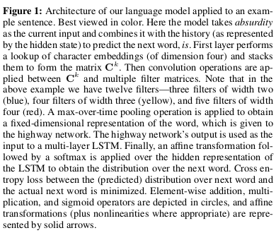

这里我们主要关注最下面的卷积层次, 对于一个单词, 会有各种各样的卷积子,总共是2049个. 而这2049并不是都能发挥很大的作用, 因为 2049 个卷积子的长度是不同的, 这篇论文中的最大长度是50. 对于具体每个长度该有多少个卷积子并没有细说.

#### 6.2 CNN-softmax

首先 CNN-softmax 就是指利用上面的字符卷积网络, 从词汇 $w$ 生成词向量 $e_w$,  再与上下文词汇相乘

$z_w = h^T\cdot CNN(chars_w) = h^T\cdot e_w$ , 进行softmax计算 $softmax(w) = z_w / \sum_i^Nz_i$ 的过程.

CNN-softmax动态的生成词向量, 有如下几个优点:

- 避免了使用很大内存去记录词汇向量. 大大减小了需要训练的参数.(因为之前每个词汇的词向量都是参数.)
- 可以赋予没有在训练库中出现的词汇合适的向量.

同时该方法有一些缺点. 

- 函数是连续的, 无法满足一些形状相似但是意义不一样的词汇的词向量生成.

改进方法:综合上面的方法和原有词向量法, 即:

**赋予每个词汇一个短的词向量同时, 还要利用字符卷积**. 公式如下:

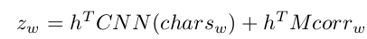

其中, $corr_w$ 是一个128维的短向量. $M$ 是将128向量线性映射到真实向量长度的转换矩阵.

#### 6.3 Projection layer

这个是LSTM中的一个特殊的结构, 在最原始的网络中是没有这个的. 

他是加在原始的LSTM的hidden state上的另外一個转换层. 转换层的输出成为这个LSTM的output.

这个新的结构的 LSTM 叫做 LSTMP.

