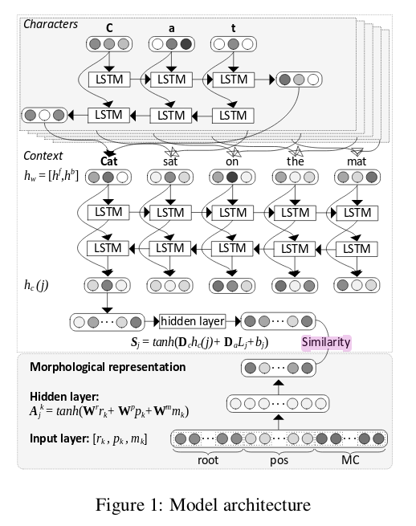
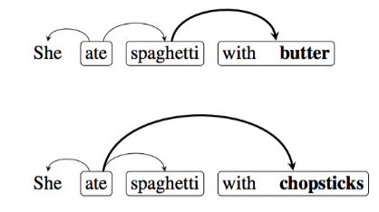
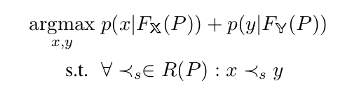
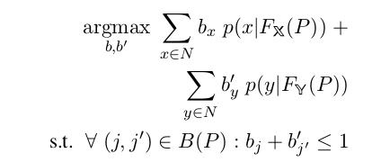

### 1. *Neural Symbolic Machines: Learning Semantic Parsers on Freebase with Weak Supervision*

利用神经网络去实现符号推理是难的,因为需要处理一个巨大的知识关系网中的离散目标.这篇论文提出了一个Nerual symbolic machine 去解决这个问题.论文提出了一个 <a  neural  programmer> 将自然语言提问转化为了一个高级程序.这是一个squence to squence 模型,并且使用了 <key-variable memory> 去解决推理中的组合问题.

然后有提出了一个 <a symbolic “computer”> 即一个Lisp解释器执行程序执行,这个作为一个嵌入的computer去计算高级程序的结果. 这样问题就转化为了一个squence-to-squence问题.

To  train  with  weak supervision  and  improve  the  stability  of REINFORCE  we  augment  it  with  anit-erative maximum-likelihood training process.  

###2. *Neural End-to-End Learning for Computational Argumentation Mining* 

AM: Argumentation Mining

**论证挖掘,论证研究有几个子任务:**

1. component segmentation:将不同的论证单元分开
2. 将每个论证单元分为前提和主张(premise,claim)
3. 找到不同论证单元之间的关系
4. 把找到的关系分为支持和攻击两类.

**先行研究与我的方法:**

- 先训练对于各个子人物的独立模型,	然后通过一个整数线性模型来编码全局约束,用来串起来各个子模型,比如"每个前提必须要有一个父项". 这个方法有很多问题,第一,手工特征太多,而实际问题中不同的论述结构就要有不同的特征;第二,这种管道式(pipeline)的方法从机器学习的角度看是不可取的,这样会使得error传递放大,而不是找到之间的关系.
- 我们的方法,找到**joint**的**nerual**方法

**多个方法简介:**

- 把AM的端到端的问题视为一个**依存分析**的问题.因为argument structure often form trees.这个方法是基于**token level** , 而不是已component为基础单元的.并且,这个里面,没有假设已经排除了所有的非component部分.

  > 这里用到了一个很重要的理念,语义的依存性,依存性不止于句法.

- 把这个问题当作一个**序列标注问题**. 原因是:

  而在这个模型中最难的是如何将关系也包含进模型内.方法是,将相连的(有直接联系的)component之间的距离编码到序列中.而在AM问题中,相关的实体之间往往隔了很多词汇,因此对于这种超长距离的依存关系,使用序列标注模型是最有效的.

- 把AM视作一個 **多任务问题**. 将每个子任务在多任务模型上训练后都会提升效果.

- 当做一个**sequential(entity) and tree(relation) structure information** 问题,这个模型可用于很多抽出实体和关系的模型.具体模型是其他论文写的.

**结论**

- nerual模型要比feature-based的模型要好.

- BiLSTM标注器在目标识别上表现的非常好.

- 耦合component和关系识别不是一个好的方法.要分开的对待各个子模型.再joint起来.

  ​

### 3. *Learning Structured Natural Language Representations for Semantic Parsing*

- **abstract**

  介绍了一个nerual semantic parser将自然语言符号转化为可以进行谓词结构运算的**谓词论证结构**的中间形式. 是通过将拥有上下文的自然语言投射到一个**特定域 **.

  这个semantic parser是一个端到端模型,使用了注释的逻辑形式及其定义.

- **introduction**

  现在的语义分析总结来说可分为两类. 一类是直接将自然语言符号应用到具体的问题中,形成一套规则.第二类是, 先将符号利用句法分析器,转化为一个独立于任务的中间表达形式.再在具体任务中进行处理.第二个方法好在其在未知知识上的可拓展性.

  虽然如今的encoder-decoder模型非常的受欢迎,但是用在这里,还是属于第一个方法,但是相比于那些利用语义框架的方法,优点有:降低了对限定领域先验知识以及语法的需要.但是代价就是黑箱操作,我们无法得知语法处理的过程.这个认知过程的确实对于我们对接下来模型的改善是相当不利的.此外在非限定的情况下,就会因为没有约束而产生ill-form问题.

  - 模型的抽象描述

    为了解决上面的问题,我们提出了基于第二类方法的模型.基于数据,我们谓词论述结构形式的中间过渡表征.这是通过一个过度模型来产生递归语义结构的方式来实现的.  这样的情况下,他是有一个基本的逻辑推导框架的,为了扩充这个框架的能力,使用了递归结构.将广度用深度代替.实现了易自动化以及高正确率化(因为规则变少). 这个过渡模型没有进行特征分解,因此可以实现更丰富的,不受局限的特征.

    接下来,就要进行过ground, 这里有个前提是,上面得到的ungrounded数据和下面grounded之后的结构要是同构的.通过一个神经映射模型.

  - 模型的具体描述

    端到端模型, 自然语言符号->句子的信息以及逻辑结构. 基于四个数据库实验, GEOQUERY, SPADES, WEBQUESTIONS, GRAPHQUESTIONS. 结果是在前两个数据集上得到最优.一个副产品是,可以一定程度上合理化神经语义分析.通过对传统syntax-based方法的对比,一定程度上打开推理的黑箱.但是有时的结果显示脱离了语义常识.

- **一些其他的信息**

  - ungrounded信息
    - 提出了一个简单的通用领域谓词,也就是在这个基础上进行递归推理. 
    	 过度系统提出了三种ACTION: NT(Non-Terminal predicate,非终端谓词,类似于生成文法中的非终端符号), TER(Terminal entity, 终端实体不包含变量.) 	RED(Reduce, 即向下推导). 
  - grounded部分
    - 由于ungrounded 与 ground 同构,因此这里是一个词法映射问题,用一个简单的双层神经分类网络实现.

### 4. *Morph-fitting: Fine-Tuning Word Vector Spaces with Simple Language-Specific Rules*

- **abstract**

  对于形态复杂的语言而言, 其词向量模型有两点不足: 第一, 对于rare词汇缺乏表现力. 第二, 对于具有相似分布的词向量们,无法区分其之间的关系(同义以及反义). 在这篇论文中,增加了一个morph-fitting procedure去增加简单的形态约束->(将形态变化的词汇向量相近, 使派生反义词词向量远). 从结果来看, 1. 提升了rare词汇的表现力. 2. 提升了整体词汇词向量的表现力. 

- **Introduction**

  这个模型简单来说,就是对正常训练好的词向量模型进行了一个再次微调. 那么重点就在这个微调的地方.

  根据上面说的,这个模型主要处理两个问题:

  1. 处理一些低频词汇的无表现力问题,依据是,一般rare的词汇的信息蕴含其复杂的形态素组合中.
  2. 不仅仅是简单的认知两个词汇的相似性,还要在相似性的基础上,分出同义和反义.

  基本方法就是利用 attract和 repel 两个词汇集, 去将 attract 中的词汇拉近, 把repel中的词汇推远. 

  其中预训练词向量采用的是word2vec. 训练模型采用的是ATTRACT -REPEL模型. attract,repel词汇集是根据语种来人工限定规则的. 词汇集的形式是,一个词汇对,attract和repel中分别时同义和反义的词汇,, 根据这两个分别设置了两个损失函数. 最后还设置了一个新向量与原向量差的损失函数,为了使得向量可以不会偏离太多.

> 这个方法只能处理正义反义之间的不同,没法区分其他的类型的形态素涵义.是否可以通过最小熵来确定形态素,赋予形态素具体向量,然后再通过某种方式组合起来形态素,形成其语义向量. 

### 5. *Character-Aware Neural Morphological Disambiguation*

这篇文章简单说.

首先,这篇文章要解决的是形态素消歧问题, 形态素消歧这个问题存在于一些特殊的语言中,例如,土耳其语. 在这种语言中, 词义并不像英语和中文一样可以大概的用这个词汇来表示,因为土耳其语中的词汇虽说是基本单位,但是对于同一个单词存在着很多的解释方式.  因此如何去解释,这一个词汇, 也就是如何理解这个词汇中的形态素, 就是一个很重要的问题. 比如说:

a  Turkish word adam can  be  analyzed  as:  

(i) a man  : [adam]1+[Noun]2+[A3sg+Pnon+Nom]3 

(ii)my island : [ada]1+[Noun]2+[A3sg+P1sg  +Nom]3

可以看到,一个词的**解释**由三部分组成, 这个词的词源(root:adam|ada), 这个词的词性(Noun), 这个词的形态素解释(后面的,这个是可以给出的.) 

那么, 如何确定一个词的形态素在上下文中的意义就尤为重要. 

该论文提出了一个深度监督模型. 下面介绍模型的输入输出:

首先模型分为两个部分, 一个是已知该词汇可能拥有的**解释**. 这个最为其中一个模型的输入. 另外一個是上下文信息以及字符信息(也就是词汇的拼写),这个是作为另外一個模型的输入. 

第一个模型可以根据词汇的N个解释生成N个词向量. 第二个模型只会根据上下文生成一个词向量. 那么, 要做的就是, 从N个词向量中, 使得正确的解释下生成的词向量与第二个模型生成的词向量最接近. 图如下:

### 6. *From Characters to Words to in Between: Do We Capture Morphology?*

- **Abstract**

  这篇文章很有意思,正好的做了刚刚想到的一点, 那就是去论证, 是否可以从字符的组合中获取形态素信息. 论文实现了很多模型, 模型主要可以根据一下三点进行分类: 1). 表征的基本单元 2). 表征的组合方式 3). 建模所基于的语言的类型不同. 结果显示,一个基于字符组合结构的三元gram模型,组合方式为BiLSTMs的模型是最优的,但是,这些模型都无法获得使用真正的形态素信息的模型. 也就是说, 现阶段的研究中, 无法从词汇中获取足够多的形态学信息.

- **Introduction**

  首先,如今的词向量是将一个有限的集合投射到连续空间的方法,这个方法有几个很明显的问题. 

  1. 它使用一个封闭的词汇假设，只能使用通用的词汇外处理。
  2. 无法分析词汇与词汇之间的功能性关系.对于一些高频出现的词汇也许这些还可以进行分析,例如,dog和dogs. 但是对于低频词是性不通的

  因此,之前有过一些使用形态素来增强词向量的研究,但是他们的问题在于使用了现成的形态素分析器. 同时, 另外由于一些具有相同意义的形态素经常在不同的词汇中表现为不同的形态,例如,-s,-es. 因此就有人利用字符的组合表征来增强向量. 这些模型得到了广泛的研究. 有能力去表现罕见的词汇以及未知的词汇, 但是问题在于:通过字符组合表征是否能够增强NLP的各种任务的效果?

  但是目前的未知的论文之间都是在不同的人物上和word-level的model进行对比,针对此. 

  论文提出了四个问题:

  1. 基于形态素组合的和基于字符组合的词汇,哪些更好一些?
  2. 最好的使用sub-word信息的方法是什么?
  3. 基于字符组合的模型是否能获取形态素带来的预测效用(即类似于, dogs-dog+cat = cats 这样的效果)
  4. 不同的模型与不同的语言的类型的关系是什么?

  本文针对语言模型试验了各种各样的模型. 并且对结果进行评价,方法为评价模型结果的困惑度.

  > 困惑度 : 信息论中，困惑度度量概率分布或概率模型的预测结果与样本的契合程度，困惑度越低则契合越准确。该度量可以用于比较不同模型之优劣。其实就是看模型对自己做出的答案的确信度. 看[这里](https://www.quora.com/How-does-perplexity-function-in-natural-language-processing)的第二个答案.

  模型有三个分类标准. 1). subword单元的种类(字符 | 形态素) 2). 组合的函数 3). 语言的类型分类

  分析的结论如下:

  1. **subword的种类**: 对于大多数的语言, 字符级别的表征方法更有效. 特别是使用了biLSTMs的trigram模型效果是最好的. 
  2. **组合方法: ** 基于Bi-LSTMs以及CNN的方法是最好的
  3. 即使是最好的方法也无法获取真正的形态分析那样的好效果.
  4. 基于字符的方法在各种语言类型都有效,但是正写法影响了其有效性. 

### 7. *Morphological Inflection Generation with Hard Monotonic Attention*

- **Abstract**

  这篇论文有两个关键词, **跨同一语系语种学习** ,**形态素分割**. 这里提出了一个非参贝叶斯模型去联合的(jointly)推导一些语种下的形态素分割, 并且同时考虑了跨语种的形态素模式发觉或者抽象形态素的发觉. 结果发现, 将不同语种的形态素模型进行串联后, 比单元模式的模型降低了24%的错误率. 并且为当各个语种属于同一语系的时候,可以提高性能这一结论提供证据. 

- **Introduction**

  - **Motivation**

    这是一篇强调语种之间的联系带给语言理解效用的论文. 开篇讲了三大功效: 1). 揭示了语言变革. 2). 有助于语言原型的建立. 3). 有助于理解通用语言. 并且提出了两个研究目标:

    1. 探究,跨语言的研究对非监督学习是否有加益?
    2. 探究, 当联合分析属于同一语系的多种语言时,是否可以增强模型?

    而研究这个问题的载体是形态素分析. 选择这个任务的原因是, *不同语言之间的形态素含有强烈的一致性* 这个假设已经被证明. 

    > 这里的这个定论极为重要!!!!

  - **Model - Intuition**

    这篇文论文具体做的是,跨语种的形态素分割以及不同语种之间形态素的对齐.英语其实是一种词性变化很少的语言, 复杂的概念是通过不同词汇的组合表达的. 而在本论文验证的三种语言中,词性变化是很复杂的, 并且三种语言对与同一概念的表达通常是同源词汇的不同变种. 因此, 英语可以作为一种解释高度词性变化语种中存在的歧义的工具. 注意出现了一个新的概念: **不同语系的语言起到消歧的作用**

    下面该文章有提出了一个有意思的问题,这个问题可以看作是对上面的第二个问题的具体描述:

    **在什么情况下跨语种学习更有效一些? 是持有同一语言学特征的同语系语言?还是使用不同语系的语言来提供消歧的能力?**

    为了验证这个问题, 论文设计了双语的形态素分割模型. 其中这个模型可以同时利用到双语之间的相似性与差异性.  对于每对语言, 模型都希望可以获得拥有更高频次的形态素.这是模型的基本出发点. 并且,这里对从双语中分割出来的形态素对中,含有相同语义或者功能的形态素对称为 abstract  morphones.  这些是通过反复出现的双语对应模式中自动提取的. 例如, 中文与英文中 , "前- : pro-" ,这一组合应该是进行出现的,那么就认为这两个属于同一个抽象形态素. 但是当另外语言中没有其对应的相应形态素, 我们的模型会 language-specific 的对这一现象进行解释.(这一行为可以视作对上面那个加斜定论的证实.)

  - **Model - Frame**

    该模型采用的是概率框架. 采用的是Dirichlet Process priors的层次贝叶斯模型. 另外,我们定义了一个在抽象形态素上定义了一个先验, 这个先验可以整合两个字母表之间的音韵学知识,使双语中潜在同源的形态素更大的先验可能性. ....这个地方太难了, 放弃.

  - **Conclusion**

    对于两个初始问题,答案是是的.

    1. 多语对照学习可以提升非监督分析质量(无论是同语系还是不同语系,且目前只针对形态素分解模型而言).
    2. 相似的语言可以更好的提高分析质量. 

### 

### 8. *Ontology-Aware Token Embeddings for Prepositional Phrase Attachment*

- **Abstract**

  如今的type-level词向量都是在不管上下文的情况下赋予所有的 type-level 词汇同样的词向量. 本文使用了一个对于上下文敏感的词向量去预测 prepositional phrase attachments (介词短语). 并且联合学习了 concept embedding 和 模型参数. 结果显示使用 上下文敏感的向量显著提升了介词短语预测任务的效果.

- **Introduction**

  type-level word embedding 是这个文章中定义的一个关键词. 其意义不同于 token-level. type-level 识别的是词汇,也就是词汇的变形(-ed,-ing,-s,..)都会被视为同一个词汇. 

  这样会产生两个问题, 第一, **无法利用词汇的多义性** . 第二, **无法使得lake和pool这样的词义相近,但是完全不一样的词汇拥有相似的空间**. 并且在目前的各种tasks中, 都用着在训练的过程中微调词向量的机制,但是这个存在的一个问题是, **使得常用词的词向量渐渐偏离了那些词义相近但是rare的词汇**. 

  为了解决上面提到的这三个问题, 已经有一些研究, 比如[获取wordnet中的概念的词向量](http://www.aclweb.org/anthology/P15-1173). 或者[利用知识图谱来改进词向量](https://www.cs.cmu.edu/~hovy/papers/15HLT-retrofitting-word-vectors.pdf). 但是还没有研究表明如何使用词汇本体论来推导出上下文敏感的词向量.

  在这篇论文中提出了一个在给定上下文下的token, 关于wordnet下的几个相关概念的概率分布. 并且简单的采用这几个不同概念向量的期望值作为这个词汇的词向量. 这个模型最有意思的一点是,在训练concept embedding的时候, 也就是wordnet中的词向量的时候, 对每个concept进行调整的同时, 也会对其他的相关词汇进行调整. 这样就使得一些罕见的词汇也得到充分训练.

  > 也就是说,这个模型以wordnet中的词汇作为目标来进行研究,先给予wordnet中的每个词汇(concept) 一个向量, 再在实际的语料库根据上下文找到那个token最合适的concept. 赋予其对应的向量. 而没有上下文情况的token的向量是concept向量组成的期望

  调整的方法是基于具体任务的.

  - model

    模型的具体信息这里就不多说了, 这里简要说下介词短语预测是个什么东西, 简单来说就是下图.

    

    with 所对应的对象是不一样的, 第一个with是对应的 "意大利面", 第二个是对应的 "ate".感觉有点像形态素分析. 

    模型没有太复杂就是一个 BiLSTMs的编码-解码模型

### 9. *Apples to Apples: Learning Semantics of Common Entities Through a Novel Comprehension Task*

这篇论文简单说, 不是很有意思的一篇论文. 

这篇论文想做的是去理解实体的真实本质, 其方法是通过crowdsource获取大量的对于两个不知名但是相似实体的描述段落, 附着这两个实体的真实词汇.  通过神经模型和语义解析两种类型的方法, 搭建了各种模型.

模型除了使用方法之分外, 还对分类选择的方式进行了分类, 其中, 一个是对分类法,从所有备选实体中选择两个, 一个是给出两个实体, 判断这断文字是不是对这两个数据的描述. 

基于神经的模型,就不讲了, 就是那些东西. 

基于语义模型的.

- 描述信息被大概分为两个类型,
  - Sentences with Absolute Information. 就是针对某单个实体的描述.
  - Sentences with Relative Information. 对两个实体进行的比较.

- **使用的框架及方法**

  - 使用的语义框架为 TRIPS.  -> 针对的是absolute information(抽出的是实体的具体信息)

  - 使用的语义框架为structured prediction model -> 针对的是Relative Information. (抽出的是实体之间的比较结构.)

  - 将上面的两个框架下获得的信息分别记作 $F_x(P), F_y(P)$ 以及 X和Y之间的关系 $R(P)$. 利用两个信息组成了下面的约束优化问题:

    

    这里有几个细节需要注意, 

    - 第一个 $F_x(P), F_y(P)$ 都是一种图的结构, 如何去作为参数比较呢? 这里用的是2000年的模型,  Regularized Gradient Boosting (XGBoost) classifier . 
    - 如何表达约束信息. 采用的是  Integer Linear Programming (ILP) 模型去解决. 

    通过这两个模型的描述, 将上述优化问题转化为了一下形式,然后用解决最优化的方法去训练参数:

    

### 10. *Semantic Word Clusters Using Signed Spectral Clustering*

### 11. *Skip-Gram - Zipf + Uniform = Vector Additivity* 

### 6. *The State of the Art in Semantic Representation*

### 7. *Deep Learning in Semantic Kernel Spaces*

### 8. *Deep Semantic Role Labeling: What Works and What’s Next*

### 9. *MORSE: Semantic-ally Drive-n MORpheme SEgment-er*

### 10. *Polish evaluation dataset for compositional distributional semantics models*

### 11. *Semantic Dependency Parsing via Book Embedding*

**Learning a Neural Semantic Parser from User Feedback*

*Abstract Syntax Networks for Code Generation and Semantic Parsing*

*Robust Incremental Neural Semantic Graph Parsing*

*Learning Semantic Correspondences in Technical Documentation*

*Interactive Learning of Grounded Verb Semantics towards Human-Robot Communication*

*Deep Multitask Learning for Semantic Dependency Parsing*

*Semantic Parsing of Pre-university Math Problems*

*Vector space models for evaluating semantic fluency in autism*

*Neural Architectures for Multilingual Semantic Parsing*

*Improving Semantic Composition with Offset Inference*

*Neural Semantic Parsing over Multiple Knowledge-bases*

*Improving Semantic Relevance for Sequence-to-Sequence Learning of Chinese Social Media Text Summarization*

*Exploring Diachronic Lexical Semantics with JeSemE*

*RelTextRank: An Open Source Framework for Building Relational Syntactic-Semantic Text Pair Representations*

*Semedico: A Comprehensive Semantic Search Engine for the Life Sciences*

*UCCAApp: Web-application for Syntactic and Semantic Phrase-based Annotation*

*Deep Learning for Semantic Composition*

*Verb Physics: Relative Physical Knowledge of Actions and Objects*

*Scalable Bayesian Learning of Recurrent Neural Networks for Language Modeling*

*Topically Driven Neural Language Model*

*Learning Cognitive Features from Gaze Data for Sentiment and Sarcasm Classification using Convolutional Neural Network*

*Learning bilingual word embeddings with (almost) no bilingual data*

*Abstract Meaning Representation Parsing using LSTM Recurrent Neural Networks*

*Vancouver Welcomes You! Minimalist Location Metonymy Resolution*

*Watset: Automatic Induction of Synsets from a Graph of Synonyms*

*Neural Modeling of Multi-Predicate Interactions for Japanese Predicate Argument Structure Analysis*

*Multimodal Word Distributions*

*Determining Gains Acquired from Word Embedding Quantitatively Using Discrete Distribution Clustering*

*Towards a Seamless Integration of Word Senses into Downstream NLP Applications*

*Character Composition Model with Convolutional Neural Networks for Dependency Parsing on Morphologically Rich Languages*