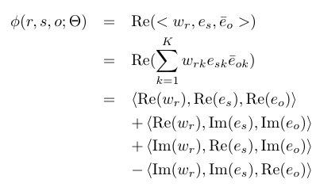
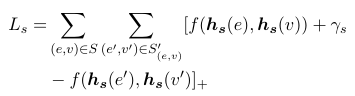
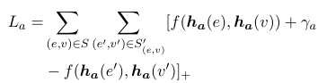
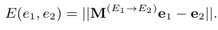
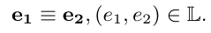
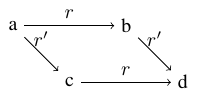
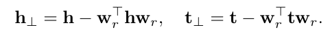
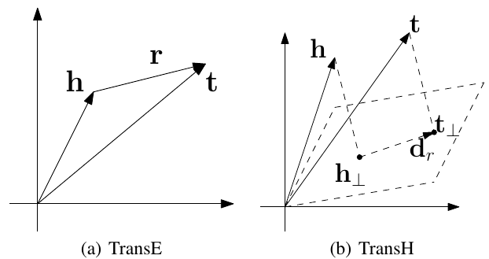

### *Towards Understanding the Geometry of Knowledge Graph Embeddings*

##### 1. What is the task tackled in this paper ? 

- Understanding the geometry of Knowledge Graph Embeddings

##### 2. What is the research question in this paper ? 

Four questions :

###### 1) Does model type (e.g., additive vs multiplicative) have any effect on the geometry of embeddings? 

###### 2) Does negative sampling have any effect on the embedding geometry? 

###### 3) Does the dimension of embedding have any effect on its geometry? 

###### 4) How is task performance related to embedding geometry?

##### 3. How to solve it/what is the approach of this paper ?

- Experiment on six embedding models :
  - Additive model : TransE, TransR, STransE
  - Multiplicative model : DistMult, HoLE, CompIEX

- After train embedding, cluster embeddings into several groups. And caculate length and conicity on each group. 
  - lengths : The average length in that group. 
  - conicity :  a high value of Conicity(V) would imply that the vectors in that group lie in a narrow cone centered at origin. 
- Results :  The answers to four questions is given in paper. In brief:
  - The performance of additive model is more stable to change in hyperparameter setting and embedding geometry than multiplicative models. 

### *Complex Embeddings for Simple Link Prediction*

#### 1. What is the task tackled in this paper ?

- Solve link prediction problem through latent factorization. 

#### 2. What is the research question in this paper ? 

- Dot products of embeddings can not handle antisymmetric relations. 

#### 3. How to solve it/what is the approach of this paper ?

- Use complex vectors and Hermitian dot to replace real-vector and dot product. 

- Complex vectors can effectively capture antisymmetric relations while retaining the efficiency benefits of the dot product. 

- Fourmla of energe function :

  

  ​

### *A Joint Embedding Method for Entity Alignment of Knowledge Bases*

#### 1. What is the task tackled in this paper ? 

- Align same entities between different knowledge graphs through a seed set of aligned entities. 

#### 2. What is the research question in this paper ? 

- There is no such useful dataset. 
- All the related work is based on content similarity calculation and propagation, the global structure information of KBs is not considered. 

#### 3. How to solve it/what is the approach of this paper ?

- Collect the alignment dataset from DBpedia and freebase. 

- Proposed a joint model based on three joint loss functions

  - Margn-based loss

    

  - Vector-size normalization loss
    $$
    \sum_{y\in \{h,h',r,t,t'\}} ||y||_2-1
    $$

  - Alignment loss (Two kinds)

    - Distance-based Axis loss : 
      $$
      \sum_{(e_i,e_i')\in A}||e_i-e_i'||
      $$

    - Linear transformation loss :
      $$
      \sum_{(e_i,e_i')\in A}||M_de_i-e_i'||
      $$

### *Multilingual Knowledge Graph Embeddings for Cross-lingual Knowledge Alignment*

#### 1. What is the task tackled in this paper ? 

- Matches the monolingual knowledge among various human languages through multi-lingual knowledge base. 

#### 2. What is the research question in this paper ? 

- Crosslingual alignment model with human involvement and designing hand-crafted features is at the cost of extensive, which is inefficient. 
- Others need well-established schemata or ontologies which is hard to collect. 

#### 3. How to solve it/what is the approach of this paper ?

- Use a joint embedding model only with graph information. 

- Proposed a joint model based on two joint loss functions:

  - Knowledge embedding loss function : TransE

  - Three kinds of alignment loss functions :

    - Distance-based Axis Calibration : 
      $$
      S = ||h-h'|| + ||t-t'||
      $$

    - Translation Vectors
      $$
      S = ||h+v_{ij}^e-h'|| + ||t+v_{ij}^e-t'||
      $$

    - Linear Transformations
      $$
      S = ||M_{ij}^eh-h'|| + ||M_{ij}^et-t'||
      $$

### *Cross-lingual Entity Alignment via Joint Attribute-Preserving Embedding*

#### 1. What is the task tackled in this paper ? 

- Entity alignment : finding entities in two KBs that refer to the same real-world object.

#### 2. What is the research question in this paper ? 

- Attribute triples account for a significant portion of KBs, but it isn't used in previous methods
- The existing alignment between cross-lingual KBs usually accounts for a small proportion. It is important to make the best use of them. 

#### 3. How to solve it/what is the approach of this paper ?

- Regards two graphs as a single graph by the bridge of seed alignment entities. 

- Train on knowledge embedding loss function (has two part)
  - SE : Structure embedding 

  - AE : Embedding attribution to a similarity matrix with 2-gram.

    Similarity matrix is used as a constraints on structure embedding. 

### Cross lingual Knowledge Graph Alignment viaGraph Convolutional Networks

#### 1. What is the task tackled in this paper ? 

- Cross-lingual KG alignment : the task of matching entities with their counterparts in different languages

#### 2. What is the research question in this paper ? 

- Previous works try to need hyper-parameters to weight the loss of entity alignments in the loss functions of their models, because they jointly model the cross-lingual knowledge and the monolingual knowledge. 
- The attributes of entities (e.g., the age of apeople, the population of a country) have not been fully utilized in the existing models. 

#### 3. How to solve it/what is the approach of this paper ?

From top to bottom of the model. 

- Two kinds of loss functions, which are trained sperately. 

  - Knowledge graph margin-based ranking function.

    

  - Attribution margin-based ranking function.

    

- The entity sets used above is seed alignment entities set. 

- The alignment function is :
  $$
  f(e_i,e_j) = ||e_i-e_j||
  $$

- Use network structure of GCNs to embed each entity ($e$)  in graphs.(Omit the hyper-parameter here) 

### *Iterative Entity Alignment via Joint Knowledge Embeddings*

#### 1. What is the task tackled in this paper ? 

Entity alignment : link entities and their counterparts among multiple knowledge graphs. 

#### 2. What is the research question in this paper ? 

- Previous methods incline to use external information of KGs, which are lack of scalability . 
- Most existing works have not well studied the effectiveness of rich internal information in KGs for entity alignment.

#### 3. How to solve it/what is the approach of this paper ?

Method consists of three parts:

- Knowledge Embeddings:

  Use PTransE as Knowledge Embeddings model which can incorporate multi-step path information compared to TransE. 

- Joint Embeddings (Three kinds)

  - Translation-based Model 

    

  - Linear Transformation Model

    

  - Parameter Sharing Model

    

- Iterative Alignment.

  Use new aligned entity pairs with high confidence as new seed to join in next training. 

### *LinkNBed: Multi-Graph Representation Learning with Entity Linkage*

#### 1. What is the task tackled in this paper ? 

- Learns entity and relationship representations across multiple graphs.
- Identify entity linkage across graphs

#### 2. What is the research question in this paper ? 

- Knowledge graphs also share a set of overlapping entities and relationships with varying information about them. But there is no research to use it. 

#### 3. How to solve it/what is the approach of this paper ?

- Proposed a joint model based on two joint loss functions:
  - Use three kinds of information to catch entity and relation embedding in the graph,  which are :
    - Entity Neighborhood Context : nodes' Neighborhood
    - Entity Attribute Context Ac (e)  : The Attribute to describe this node. 
    - Relation  v : relation itself. 
    - Relation Type Context Tc(r) : same as Entity Neighborhood Context
  - Use two insight to alignment seed alignment entities:
    - Embedding of aligned entities should be close.
    - When $e_s$ is replaced by $e_s'$ , the loss value of $(e_s, r, e_o)$ should be similar to $(e_s', r, e_o)$

###  *One-Shot Relational Learning for Knowledge Graphs*

#### 1. What is the task tackled in this paper ? 

- Knowledge graph link prediction. 

#### 2. What is the research question in this paper ? 

- Long-tail relations (which have very few instances) are actually more common in KGs and those newly added relations often do not have many known triples for training.
- Previous methods can not capture up-to-date knowledge, which new relations are added frequently. 

Those problems can be seen as one-shot problem. 

#### 3. How to solve it/what is the approach of this paper ?

- The core of this model is to minilize similarity function of two entity pairs :
  $$
  \mathcal{M}((h,t),(h',t')|\mathcal{G}')
  $$
  When $(h_0,r,t_0)$ is known, the probability of $(h_i, r, t_i)$ can be caculated even $r$ is only appeared one time. 

- Unlike other method which embedding is learned by factorization or translation, this method doesn't put too much constraints on it's structure. It trains on LSTMs and conditional probabilstic $p(h_i, r, t_i|C_{h,r}, D_{train})$. $C_{h,r}$ is other entities and $D_{train}$ is only instances for training. 

### *Knowledge Graph Embedding with Hirerachical Relation Structure*

#### 1. What is the task tackled in this paper ? 

- Knowledge graph link prediction. 

#### 2. What is the research question in this paper ? 

- Most of the existing works simply embed relations into vectors. **Less efforts** have been made for investigating the rich information **(hirerachical information)** from the relation structure.

#### 3. How to solve it/what is the approach of this paper ?

- Train TransE first.

- Define a three-layer hierarchical relation structure

  - Relation clusters : Higher level vector in hirerachical structures. 

    Method : Use k-means directly on relations vector - > Relation clusters embedding 

  - Relations : Usual relaions vector. 

    Method : Use original TransE relation vectors. 

  - Sub-relations : Aussme that a relation have several semantic meanings and can be split into several sub-relations. 

    Use $h-t$ for each triplets contains relation r, and cluster the loss with k-means 

- Add regularization constraints of three kinds relation vectors on original loss function. 

### *Analogical Inference for Multi-relational Embeddings*

#### 1. What is the task tackled in this paper ? 

- Learning the latent representations for entities and relations in large knowledge graphs.
- Evaluated by link prediction task. 

#### 2. What is the research question in this paper ? 

- The view of study the solutions of the problem from the analogical inference is missing so far in the research.  

#### 3. How to solve it/what is the approach of this paper ?

- Insight : to support analogical structure below :

  

- Add two constraints on orignal latent representation loss function. 

  - Normality constraints : 
    $$
    s.t. W_r^TW_r = W_rW_r^T
    $$

  - Commutative constraints :
    $$
    s.t. \  W_rW_{r'} = W_{r'}W_r
    $$

### *Incorporating GAN for Negative Sampling in Knowledge Representation Learning*

#### 1. What is the task tackled in this paper ? 

- Knowledge representation : model knowledge graph by encoding entities and relations into a low dimensional space.

#### 2. What is the research question in this paper ? 

- the negative triplets are constructed by replacing either head or tail entities of positive triplets with entities randomly sampled from the whole entities set.
- When the training process goes on, training loss under this sampling method very likely to gives rise to zero loss problem.

#### 3. How to solve it/what is the approach of this paper ?

- Goal : Provide consistent non-zero loss for training. 

- Methods : Use generative adversarial deep models (KBGAN) to improve the training, which generator in GAN can provide high-quality negative sampling. 

### *Analysis of the Impact of Negative Sampling on Link Prediction in Knowledge Graphs* 

#### 1. What is the task tackled in this paper ? 

- Knowledge representation : model knowledge graph by encoding entities and relations into a low dimensional space.

#### 2. What is the research question in this paper ? 

- Negative instances can be generated using a variety of methods in link prediction task, but no analysis has been done on it. 
#### 3. How to solve it/what is the approach of this paper ?

- Analyize impact of six negative sampling methods on the performance of link prediction in knowledge graphs, for four methods for graph embedding – ComplEx, DistMult, Rescal,TransE. 
- Six negative sampling methods are :
  - Random sampling : orignal method.
  - Corrupting positive instance : replace head/tail entity with one which is conjugate with relation in other triplets.
  - Typed Sampling : replace with entity which have same type. 
  - Relational Sampling : not only entities can be replace, so as relations. 
  - Nearest Neighbor sampling : select the entity close to target as replacement with metrics of NN. 
  - Near miss sampling : compared to previous sampling method, metircs change from entity vector to f(entity, relation) which operate on (entity, relation) pair. 
- Near miss sampling is the best. 

### Embedding Multimodal Relational Data for Knowledge Base Completion*

#### 1. What is the task tackled in this paper ? 

Representing entities and relations in an embedding space

#### 2. What is the research question in this paper ? 

- Existing methods are ignoring the variety of data types such as text, images, and numerical values that are often used in knowledge bases. 

#### 3. How to solve it/what is the approach of this paper ?

- Use different neural encoders for this variety of observed data, and combine them with existing relational models to learn embeddings of the entities and multimodal data.
- Introduce a novel multimodal imputation model to generate missing multimodal values, like text and images, from information in the knowledge base. 

### *Knowledge Graph Embedding by Translating on Hyperplanes*

#### 1. What is the task tackled in this paper ? 

- Embedding a large scale knowledge graph composed of entities and relations into a continuous vector space

#### 2. What is the research question in this paper ? 

- There are flaws in TransE when dealing with relations with mapping properties of **reflexive**/**one-to-many**/**many-to-one**/**many-to-many**.

#### 3. How to solve it/what is the approach of this paper ?

- Embedding by translating on Hyperplanes:

  

  

  ​

### *Learning Entity and Relation Embeddings for knowledge Graph Completion*

#### 1. What is the task tackled in this paper ? 

- Embedding a large scale knowledge graph composed of entities and relations into a continuous vector space

#### 2. What is the research question in this paper ? 

- An entity may have multiple aspects, and various relations focus on different aspects of entities. But both TransE and TransH assume embeddings of entities kand relations being in the same space. 

#### 3. How to solve it/what is the approach of this paper ?

- Aim:

  Provide a methods which can transform one entity into different spaces by relation. 

- Methods : 

  Propose a new method, which models entities and relations in distinct spaces.

  Project entity embedding to relation space before caculate margin-loss:

  - Projection : 

  $$
  h_r = hM_r, t_r=tM_r
  $$

  - Margin-based loss :
    $$
    f_r(h,t）＝||h_r+r-t_t||_2
    $$

### *KBGAN : Adversarial Learning for Knowledge Graph Embedding*

[KBGAN: Adversarial Learning for Knowledge Graph Embeddings](https://www.google.com/url?sa=t&rct=j&q=&esrc=s&source=web&cd=1&ved=2ahUKEwjouO3XoeLeAhXFbbwKHZUUAi4QFjAAegQIChAB&url=https%3A%2F%2Farxiv.org%2Fabs%2F1711.04071&usg=AOvVaw0YF7kspjO3K5DKiIMzCsZC)

#### 1. What is the task tackled in this paper ? 

- Knowledge representation : model knowledge graph by encoding entities and relations into a low dimensional space.

#### 2. What is the research question in this paper ? 

- Widely used random sampling method is not ideal, because the sampled entity could be completely unrelated to the head and the target relation, and thus the quality of  randomly generated negative examples is often poor. 

#### 3. How to solve it/what is the approach of this paper ?

- Goal : Provide consistent non-zero loss for training. 

- Methods : Use generative adversarial deep models (KBGAN) to improve the training, which generator in GAN can provide high-quality negative sampling. 

### *Differentiating Concepts and Instances for Knowledge Graph Embedding*

#### 1. What is the task tackled in this paper ? 

- Knowledge Graph Embedding

#### 2. What is the research question in this paper ? 

- The difference between concepts and instances is ignored in knowledge graph embedding model. 
- Note : the difference between concepts and instances is that instance is concretization of concept, for example, two entities which connected by "InstanceOf". 

#### 3. How to solve it/what is the approach of this paper ?

- Goal : Design a geometry structure which have ability to model concepts and instances. 
- Method : Propose a TransC model which can model two kinds of relation:
  - [InstanceOf] : Use a sphere to express concepts. And a instance should be one point inside the sphere. 
  - [SubclassOf] : The size of sphere is defined by [SubclassOf] relation, which both head and tail are concepts. 

